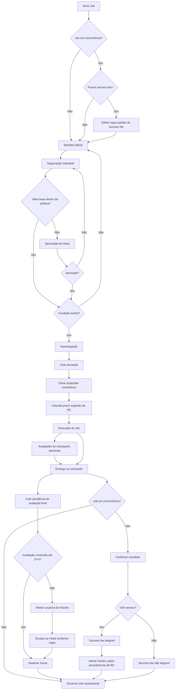

# **FREELA HUB — Documento Funcional da Plataforma**

**Versão:** v2.0  
**Projeto:** FREELA HUB | V3A  
**Responsável pelo documento:** [Renato Gioia]  
**Data da última atualização:** [17/07/2026]  
**Status:** Em evolução

### **Histórico desta versão**

A versão v2.0 consolida as seguintes mudanças estruturais:

* Inclusão de **success fee** para jobs condicionados ao êxito da V3A em concorrências.
* Exibição e negociação do success fee desde a criação da oportunidade até a homologação e alocação.
* Remoção da escolha manual de parcelas, datas e formato do fluxo de pagamento.
* Substituição das datas manuais por **projeções automáticas, orientativas e não oficiais**, calculadas conforme a política de Supply.
* Remoção do módulo de emissão e exportação de solicitação de pagamento.
* Inclusão de aviso obrigatório sobre a dependência da abertura e aprovação da RC no ERP de Supply.
* Liberação das avaliações durante qualquer momento elegível da alocação.
* Inclusão de alertas automáticos de avaliação pendente após a conclusão do job.
* Revisão da arquitetura de dados e dos relacionamentos necessários no Supabase.

---

## **1\. Visão Geral**

O **FREELA HUB** é uma plataforma interna de gestão de freelancers da V3A, criada para centralizar o cadastro, seleção, negociação, contratação, alocação, acompanhamento e avaliação de profissionais freelancers.

A plataforma também deve oferecer governança sobre valores contratados, condições de success fee, agenda, projeções orientativas de pagamento e pendências operacionais relacionadas à abertura de RC pelo núcleo contratante.

O sistema atua como uma camada de governança entre os núcleos contratantes, RH, C-Level, Operações, Heads e freelancers. A plataforma **não substitui o ERP de Supply**, não confirma datas oficiais de pagamento e não executa solicitações financeiras. Seu papel é estruturar a contratação, registrar as condições homologadas e apresentar previsões operacionais baseadas nas políticas vigentes.

Toda data de pagamento apresentada pelo FREELA HUB deverá conter o seguinte aviso:

> **Data sugerida, não oficial. O pagamento depende da abertura e aprovação da RC pelo núcleo contratante no ERP de Supply, respeitando os prazos e políticas internas.**

---

## **2\. Objetivos da Plataforma**

### **2.1 Objetivo principal**

Centralizar e estruturar o ciclo de contratação e gestão de freelancers, desde a criação da demanda até a avaliação da alocação, mantendo rastreabilidade, governança e aderência às políticas internas.

### **2.2 Objetivos específicos**

* Criar um banco único e homologado de freelancers.
* Evitar duplicidade de cadastro de profissionais.
* Controlar agenda, disponibilidade e conflitos de alocação.
* Padronizar valores por função, senioridade e modelo de remuneração.
* Apoiar os núcleos na formação de shortlists.
* Registrar negociações, exceções de valores e condições de success fee.
* Exigir aprovação para contratações fora da política.
* Gerar alocações oficiais após homologação.
* Calcular projeções orientativas de pagamento conforme a política de Supply.
* Exibir prazo-limite sugerido para abertura da RC.
* Deixar explícito que a data projetada não representa compromisso oficial de pagamento.
* Permitir avaliações durante a execução e após a conclusão da alocação.
* Consolidar avaliações de desempenho e atualizar o score dos freelancers.
* Melhorar a tomada de decisão em futuras contratações.
* Reduzir gastos desnecessários, contratações sobrepostas e retrabalho operacional.
* Preparar a arquitetura para futura integração com o ERP de Supply.

---

## **3\. Perfis de Acesso**

A plataforma possui diferentes perfis de acesso, com permissões específicas.

| Perfil | Descrição | Principais Permissões |
| ----- | ----- | ----- |
| **MASTER** | Perfil administrativo máximo | Acesso total à plataforma, gestão de usuários, núcleos, políticas, freelas, jobs, alocações, parâmetros, relatórios e auditoria |
| **RH** | Perfil de governança operacional | Gestão do banco de freelancers, pré-cadastros, links públicos, políticas de valores, apoio ao shortlist, acompanhamento de exceções e suporte ao fluxo |
| **C-LEVEL** | Perfil estratégico multi-núcleo | Atua em qualquer núcleo, cria oportunidades, participa de negociações, acompanha indicadores e pode criar núcleos quando autorizado |
| **OPERAÇÃO** | Perfil operacional multi-núcleo | Atua em qualquer núcleo, cria oportunidades, acompanha bookings, negociações, projeções e pendências operacionais |
| **NÚCLEO** | Perfil do núcleo contratante | Criação de oportunidades, shortlist, negociação, acompanhamento de bookings, confirmação de informações operacionais e avaliação de freelancers |
| **HEAD DO NÚCLEO** | Usuário do perfil Núcleo com autoridade de aprovação | Aprova ou reprova exceções de política e condições extraordinárias vinculadas ao próprio núcleo |
| **FREELANCER** | Usuário externo por link público seguro | Preenche ou atualiza cadastro, confirma condições quando aplicável e responde avaliações externas |

### **3.1 Dependência externa — ERP de Supply**

O ERP de Supply permanece como sistema oficial para abertura, aprovação e processamento da RC.

O FREELA HUB:

* Não cria RC.
* Não aprova RC.
* Não confirma recebimento da RC pelo Supply.
* Não determina a data oficial de pagamento.
* Não deve exibir status como “pagamento solicitado” ou “pagamento confirmado”.
* Pode apenas calcular projeções orientativas, prazos operacionais e alertas de risco.

---

## **4\. Módulos da Plataforma**

### **4.1 Dashboard Geral**

O Dashboard deve apresentar visualizações diferentes conforme o perfil do usuário, o núcleo acessado e o nível de permissão.

#### **Indicadores recomendados**

**Visão MASTER / C-Level / Operação**

* Total de freelancers cadastrados.
* Freelancers elegíveis e bloqueados.
* Alocações ativas.
* Jobs criados por núcleo e status.
* Jobs em concorrência.
* Jobs com success fee habilitado.
* Success fees aguardando resultado da concorrência.
* Success fees elegíveis após vitória da V3A.
* Exceções de valor pendentes.
* Projeções de pagamento com prazo de RC em risco.
* Avaliações pendentes por núcleo.
* Duplicidades na base.
* Conflitos de agenda.
* Alertas de governança e auditoria.

**Visão RH**

* Pré-cadastros aguardando análise.
* Atualizações cadastrais pendentes.
* Freelancers sem documentação essencial.
* Freelancers sem função ou senioridade homologada.
* Exceções de política em acompanhamento.
* Score e distribuição de avaliações.
* Links públicos ativos, expirados ou revogados.

**Visão Núcleo / Head**

* Jobs do próprio núcleo.
* Shortlists em andamento.
* Negociações aguardando retorno.
* Aprovações pendentes.
* Alocações ativas e próximas do encerramento.
* Projeções orientativas de pagamento.
* Data-limite sugerida para abertura da RC.
* Pendências de avaliação.
* Success fees vinculados ao núcleo e seus respectivos status.

Nenhum card de pagamento deve sugerir confirmação financeira. Os indicadores devem utilizar expressões como **“data sugerida”**, **“prazo operacional da RC”** e **“pendência no FREELA HUB”**.

---

### **4.2 Cadastro de Núcleos**

Módulo usado para cadastrar e gerenciar núcleos operacionais da agência.

#### **Campos principais**

* Nome do núcleo.
* Código do núcleo.
* Head responsável.
* E-mail corporativo do Head.
* Usuário vinculado ao Head.
* Status do núcleo.
* Histórico de demandas.
* Histórico de alocações.
* Histórico de avaliações pendentes.
* Histórico de alertas de RC.

#### **Regras**

* Cada núcleo precisa ter um Head responsável.
* Usuários do tipo Núcleo ficam vinculados a um núcleo específico.
* Usuários C-Level e Operação não ficam vinculados a um único núcleo.
* MASTER, Operação, C-Level e RH podem administrar núcleos conforme permissão.
* MASTER, RH e C-Level podem criar novos núcleos.
* A exclusão de um núcleo com histórico deve ser lógica, nunca física.
* Jobs, alocações, avaliações e auditorias devem manter o núcleo original vinculado.

---

### **4.3 Gestão de Usuários**

Módulo para administrar usuários internos da plataforma.

#### **Perfis disponíveis**

* MASTER.
* RH.
* C-LEVEL.
* NÚCLEO.
* OPERAÇÃO.

#### **Campos principais**

* Nome completo.
* E-mail corporativo.
* Perfil de acesso.
* Cargo/função.
* Núcleo vinculado, quando aplicável.
* Indicador de Head do Núcleo.
* Status operacional.
* Primeiro acesso pendente.
* Último login.
* Senha inicial ou redefinição de senha.

#### **Regras**

* Usuário do perfil Núcleo deve ser vinculado a um núcleo.
* Usuário C-Level e Operação deve aparecer como multi-núcleo.
* Usuário MASTER deve ter acesso a todos os núcleos.
* Usuário RH atua em governança e administração do fluxo.
* O sistema deve impedir perfis inconsistentes, como Núcleo sem núcleo vinculado.
* Alterações de perfil, núcleo ou autoridade de aprovação devem gerar registro em auditoria.

---

### **4.4 Banco de Freelancers**

Módulo central da base de talentos.

#### **Objetivo**

Manter uma base única, limpa, atualizada e homologada de freelancers, reunindo profissionais já contratados pela agência e atualizando seu histórico e score de performance.

#### **Fontes de entrada**

1. Cadastro manual pelo RH.
2. Pré-cadastro via link público ou QR Code.
3. Atualização cadastral via link público dedicado.

#### **Campos principais**

* Nome completo.
* CNPJ.
* E-mail.
* Telefone/WhatsApp.
* Cidade/UF/país.
* Função principal.
* Senioridade.
* Funções adicionais homologadas.
* Disponibilidade.
* Tipo de contratação.
* Experiência anterior com V3A.
* Segmentos/indústrias atendidos.
* Marcas atendidas.
* Portfólio.
* LinkedIn.
* Instagram, quando aplicável.
* Site profissional, quando aplicável.
* Observações do RH.
* Status operacional.
* Score consolidado.
* Histórico de alocações.
* Histórico de avaliações.
* Histórico de success fees vinculados.

#### **Regras de qualidade da base**

* O sistema deve impedir duplicidades por CNPJ, e-mail, telefone e nome normalizado.
* Atualização cadastral não deve criar novo freelancer.
* Link de atualização deve alterar o registro existente após validação.
* Duplicidades identificadas devem ser mescladas.
* O histórico deve ser preservado no registro consolidado.
* O score deve ser atualizado após avaliações válidas concluídas.
* CNPJ deve existir nos formulários públicos e nos perfis internos do freelancer.
* Dados sensíveis devem respeitar as políticas de acesso e LGPD.

---

### **4.5 Links Públicos / QR Codes**

Módulo para geração de links públicos seguros.

#### **Finalidades**

* Novo cadastro de freelancer.
* Atualização cadastral de freelancer existente.
* Avaliação reversa pelo freelancer.
* Confirmação de informações solicitadas pelo RH.
* Aceite ou ciência de condições, quando esse recurso for habilitado.

#### **Regras**

* Cada link deve ser único.
* Cada link deve possuir data de expiração.
* Cada link deve ter status.
* Cada link deve estar vinculado a uma finalidade.
* Link de atualização deve apontar para um freelancer existente.
* Link de avaliação deve apontar para uma alocação específica.
* O sistema deve registrar quem criou o link.
* O sistema deve registrar quando o link foi preenchido.
* Links usados, expirados ou revogados não devem permitir novo preenchimento.
* O token público não deve expor IDs internos previsíveis.

#### **Status possíveis**

* Ativo.
* Utilizado.
* Expirado.
* Revogado.
* Convertido em freela.
* Atualização aplicada.
* Aguardando preenchimento.
* Aguardando aprovação RH.

---

### **4.6 Análise de Pré-Cadastros**

Módulo onde o RH valida novos cadastros e atualizações enviadas via link público.

#### **Abas recomendadas**

* Novos freelas.
* Atualizações cadastrais.
* Aprovados.
* Rejeitados.

#### **Regras**

* Novo pré-cadastro aprovado deve criar freelancer no banco.
* Atualização aprovada deve alterar o freelancer existente.
* Rejeição deve registrar justificativa.
* Conversão deve ser rastreável.
* A aprovação não deve criar duplicidade.
* Toda mesclagem deve preservar relacionamentos históricos.

---

### **4.7 Criar Oportunidade**

Módulo usado para registrar uma nova demanda de freelancer.

#### **Quem pode criar**

* MASTER.
* RH.
* C-Level.
* Operação.
* Usuário do Núcleo vinculado à demanda.

#### **Campos principais do job**

* Núcleo responsável.
* Título do projeto/job.
* Cliente solicitante.
* Função requerida.
* Senioridade requerida.
* Regime de urgência.
* Data de início estimada.
* Data de fim estimada.
* Total de dias calculado de forma inclusiva.
* Budget previsto máximo.
* Descrição técnica/escopo.
* Entregáveis ou milestones.
* Modelo de remuneração.
* Valor previsto.
* Política de referência.
* Status da política.
* Indicador de job em concorrência.
* Indicador de success fee aplicável.

#### **Campos do success fee**

Os campos abaixo devem aparecer quando **“Success fee aplicável”** estiver habilitado:

* Tipo do success fee: valor fixo ou percentual.
* Valor fixo sugerido, quando aplicável.
* Percentual sugerido, quando aplicável.
* Base de cálculo do percentual.
* Gatilho de elegibilidade: vitória da V3A na concorrência.
* Condições complementares.
* Observações internas.
* Indicador de necessidade de aprovação extraordinária.
* Responsável pela confirmação do resultado da concorrência.

#### **Regras do success fee na oportunidade**

* O success fee deve ser opcional.
* Jobs em concorrência podem existir sem success fee.
* Jobs fora de concorrência podem usar success fee apenas mediante justificativa e permissão.
* O valor ou percentual cadastrado na oportunidade funciona como referência inicial.
* A condição pode ser ajustada individualmente durante a negociação com cada freelancer.
* O valor-base do freelancer e o success fee devem permanecer separados.
* O sistema deve mostrar o valor potencial total sem somar o success fee ao custo garantido.
* A elegibilidade só ocorre após registro formal de vitória da V3A.
* A criação ou alteração do success fee deve gerar auditoria.

#### **Regras de pagamento na criação da oportunidade**

* O usuário não escolhe quantidade de parcelas.
* O usuário não seleciona dia preferencial de pagamento.
* O usuário não cadastra datas de pagamento.
* O usuário não altera manualmente a regra de calendário.
* A projeção de pagamento será calculada automaticamente após a homologação, conforme o período definitivo da alocação e a política vigente de Supply.
* Antes da homologação, a tela pode exibir apenas uma simulação preliminar, claramente identificada como estimativa.

---

## **5\. Modelos de Remuneração e Projeção Orientativa de Pagamento**

A plataforma deve registrar o modelo de remuneração negociado, mas não deve permitir que o usuário defina manualmente parcelas, dias preferenciais ou datas de pagamento.

### **5.1 Modelos de remuneração**

A plataforma deve suportar:

* Diária.
* Hora.
* Mensal.
* Job fechado/pacote.

#### **Cálculos esperados**

**Diária**

```text
Valor-base previsto = valor diário × quantidade de dias considerados
```

**Hora**

```text
Valor-base previsto = valor por hora × quantidade de horas estimadas
```

**Mensal**

```text
Valor-base previsto = valor mensal × quantidade de ciclos mensais
```

Quando houver ciclo parcial, o sistema deve indicar a regra de proporcionalidade adotada e preservar a memória de cálculo.

**Job fechado**

```text
Valor-base previsto = valor total negociado para o escopo
```

O valor-base contratado deve ser armazenado separadamente de success fee, reembolso ou qualquer componente eventual.

---

### **5.2 Política de projeção de pagamento**

As datas apresentadas pelo sistema são **projeções operacionais**, não datas oficiais.

#### **Regra de duração**

A duração deve ser calculada de forma inclusiva:

```text
Duração em dias = data final − data inicial + 1
```

Para evitar lacuna de regra, períodos de exatamente 15 dias serão tratados na faixa de **1 a 15 dias**.

#### **Faixas de cálculo**

| Duração da alocação | Regra de projeção |
| ----- | ----- |
| **1 a 15 dias** | Pagamento projetado em até 15 dias após o término, sempre em uma terça-feira |
| **16 a 21 dias** | Pagamento projetado em até 7 dias após o término, sempre em uma terça-feira |
| **22 a 30 dias** | Pagamento projetado para a última terça-feira compreendida no período |
| **Acima de 30 dias** | Projeções mensais, na última terça-feira de cada ciclo mensal |

#### **Algoritmo recomendado**

**Períodos de 1 a 15 dias**

1. Calcular a data-limite como `data_fim + 15 dias`.
2. Localizar a última terça-feira igual ou anterior à data-limite.
3. A data encontrada deve ser posterior ao encerramento do período.
4. Caso uma regra corporativa futura determine outro corte, a versão da política deve ser atualizada sem permitir ajuste manual por job.

**Períodos de 16 a 21 dias**

1. Calcular a data-limite como `data_fim + 7 dias`.
2. Localizar a terça-feira existente entre o dia seguinte ao fim e a data-limite.
3. Esta será a data sugerida.

**Períodos de 22 a 30 dias**

1. Localizar a última terça-feira existente entre a data inicial e a data final.
2. Esta será a data sugerida.
3. Caso as datas da alocação sejam alteradas, a projeção deverá ser recalculada e versionada.

**Períodos acima de 30 dias**

1. Dividir a alocação em ciclos mensais consecutivos a partir da data de início.
2. Localizar a última terça-feira de cada ciclo.
3. Incorporar eventual período residual ao último ciclo, evitando gerar uma parcela isolada sem regra operacional.
4. Gerar uma projeção para cada ciclo.
5. Preservar a memória de cálculo e a versão da política utilizada.

#### **Aviso obrigatório**

Toda visualização de data deverá apresentar, em posição visível:

> **Data sugerida, não oficial. O pagamento depende da abertura e aprovação da RC pelo núcleo contratante no ERP de Supply, respeitando os prazos e políticas internas.**

---

### **5.3 Prazo operacional da RC**

Para cada projeção, o sistema deverá calcular:

```text
Prazo-limite sugerido da RC = data sugerida de pagamento − 10 dias corridos
```

#### **Regras**

* A RC precisa chegar ao fluxo de Supply com pelo menos 10 dias de antecedência em relação à data projetada.
* O sistema deve destacar a data-limite sugerida para abertura da RC.
* Quando a data-limite ocorrer antes do início da alocação, o sistema deve exibir alerta crítico de abertura imediata.
* Quando a data-limite ocorrer entre o início e até três dias após o início da alocação, o sistema deve exibir alerta de alta prioridade.
* O sistema não deve afirmar que a RC foi criada, recebida ou aprovada, pois essa informação pertence ao ERP de Supply.
* O usuário pode confirmar apenas a **ciência do alerta**, sem transformar essa confirmação em status financeiro.
* A projeção deve ser recalculada quando o período homologado mudar.

#### **Níveis de alerta recomendados**

| Situação | Nível |
| ----- | ----- |
| Mais de 10 dias até o prazo da RC | Informativo |
| Entre 4 e 10 dias até o prazo da RC | Atenção |
| Entre 0 e 3 dias até o prazo da RC | Urgente |
| Prazo da RC ultrapassado | Crítico |

---

### **5.4 Exemplos de cálculo**

#### **Exemplo A — Período de 10 dias**

```text
Período: 01/07/2026 a 10/07/2026
Duração: 10 dias
Data-limite: 25/07/2026
Última terça-feira até a data-limite: 21/07/2026
Prazo sugerido da RC: 11/07/2026
```

#### **Exemplo B — Período de 18 dias**

```text
Período: 01/07/2026 a 18/07/2026
Duração: 18 dias
Data-limite: 25/07/2026
Terça-feira dentro da janela de 7 dias: 21/07/2026
Prazo sugerido da RC: 11/07/2026
```

#### **Exemplo C — Período de 25 dias**

```text
Período: 01/07/2026 a 25/07/2026
Duração: 25 dias
Última terça-feira dentro do período: 21/07/2026
Prazo sugerido da RC: 11/07/2026
```

Os exemplos demonstram por que a RC deve ser considerada logo no início da alocação. Em alguns cenários, o prazo operacional pode ocorrer poucos dias após o início ou até exigir preparação anterior.

---

### **5.5 Success fee**

O success fee é uma remuneração eventual, condicionada ao resultado definido no job.

#### **Tipos permitidos**

* Valor fixo.
* Percentual sobre uma base de cálculo explicitamente informada.

#### **Cálculo**

**Valor fixo**

```text
Success fee potencial = valor fixo homologado
```

**Percentual**

```text
Success fee potencial = percentual homologado × base de cálculo homologada
```

#### **Regras**

* O success fee não compõe o valor garantido da alocação.
* O sistema deve exibir separadamente: valor-base, success fee potencial e remuneração potencial total.
* A condição negociada deve ser aceita e homologada junto com a alocação.
* O status inicial deve ser `pending_competition_result`.
* Em caso de vitória da V3A, o status pode ser alterado para `eligible`.
* Em caso de derrota, cancelamento ou perda de elegibilidade, o status deve ser `not_eligible` ou `cancelled`.
* O resultado da concorrência deve ser confirmado por usuário autorizado e registrado em auditoria.
* Até que exista política específica de Supply para o success fee, o sistema não deve gerar data oficial nem projeção automática específica para esse componente.
* Ao se tornar elegível, o sistema deve alertar o núcleo sobre a necessidade de realizar o procedimento de RC no ERP de Supply.

---

## **6\. Política de Valores**

A Política de Valores funciona como balizador para contratação e deve ser aplicada ao valor-base negociado.

### **6.1 Estrutura da política**

Cada combinação de função e senioridade deve possuir valores de referência e teto para:

* Diária.
* Mensal.
* Hora, quando aplicável.
* Job fechado, quando aplicável ou estimado por regra.

### **6.2 Campos recomendados**

| Campo | Descrição |
| ----- | ----- |
| Função/cargo | Papel profissional contratado |
| Senioridade | Nível do profissional |
| Diária referência | Valor médio recomendado |
| Diária teto | Valor máximo autorizado |
| Mensal referência | Valor mensal recomendado |
| Mensal teto | Valor mensal máximo autorizado |
| Hora referência | Valor recomendado por hora, quando aplicável |
| Hora teto | Valor máximo por hora, quando aplicável |
| Aprovação exigida | Regra de aprovação acima do teto |
| Status | Ativa, inativa ou incompleta |
| Versão | Versão da política aplicada |
| Vigência inicial | Data de início da validade |
| Vigência final | Data de encerramento, quando houver |
| Última atualização | Data de atualização da política |

### **6.3 Status da política**

* Dentro da política.
* Acima do teto.
* Política não cadastrada.
* Política incompleta.
* Aguardando aprovação Head.
* Aprovado por exceção.
* Reprovado por exceção.

### **6.4 Job fechado**

Quando o modelo for “job fechado” e houver apenas política diária ou mensal, o sistema deve estimar o teto do job com base na política disponível.

Exemplo:

```text
Teto estimado do job fechado = teto diário × dias considerados × fator de ajuste
```

A plataforma deve exibir a memória de cálculo utilizada, incluindo:

* Política usada como base.
* Quantidade de dias ou meses considerados.
* Valor de referência.
* Teto autorizado.
* Fator de ajuste aplicado.
* Valor final estimado.
* Diferença entre negociado e teto.

### **6.5 Relação entre política e success fee**

* O valor-base deve ser comparado com a política de valores.
* O success fee deve ser analisado separadamente para não distorcer o valor garantido.
* A organização pode definir um teto específico de success fee por função, job, cliente ou percentual.
* Enquanto esse teto não estiver parametrizado, o sistema deve exigir justificativa para qualquer success fee e permitir aprovação do Head quando configurado.
* A remuneração potencial total deve ser exibida para transparência, sem classificá-la como custo confirmado.
* Toda alteração da regra de success fee deve preservar a versão utilizada na negociação e na homologação.

---

## **7\. Workflow de Shortlist, Negociação e Alocação**

O fluxo principal da plataforma é composto por quatro etapas:

1. Seleção do Job.
2. Shortlist Oficial.
3. Negociação.
4. Homologação.

As projeções de pagamento não são configuradas pelo usuário durante esse fluxo. Elas são calculadas pelo sistema após a homologação, utilizando o período definitivo da alocação.

---

### **7.1 Etapa 1 — Seleção do Job**

O usuário seleciona uma oportunidade ativa.

#### **Ações**

* Visualizar lista de jobs.
* Filtrar por status.
* Filtrar jobs em concorrência.
* Filtrar jobs com success fee.
* Ordenar por colunas.
* Selecionar job.
* Avançar para formação de shortlist.

#### **Status possíveis do job**

* Oportunidade criada.
* Em shortlist.
* Em negociação.
* Pendente aprovação.
* Pronto para homologação.
* Bookado.
* Em execução.
* Concluído.
* Cancelado.
* Reaberto.
* Aguardando resultado da concorrência, quando aplicável.

---

### **7.2 Etapa 2 — Shortlist Oficial**

O sistema sugere freelancers com base em critérios de compatibilidade.

#### **Categorias automáticas**

* Melhores matches.
* Boas alternativas.
* Outras opções.

#### **Critérios de sugestão**

* Função principal.
* Funções adicionais homologadas.
* Senioridade.
* Localização.
* Disponibilidade.
* Experiência com V3A.
* Segmentos/indústrias.
* Marcas atendidas.
* Score consolidado.
* Histórico de avaliações.
* Agenda livre no período.
* Aderência ao perfil solicitado.
* Bônus por preenchimento das avaliações reversas de jobs anteriores.
* Histórico de aceite e cumprimento de condições negociadas.

#### **Informações de success fee no shortlist**

Quando o job possuir success fee, cada candidato selecionado deverá visualizar no card interno de negociação:

* Badge **“Success fee aplicável”**.
* Tipo: fixo ou percentual.
* Valor ou percentual de referência.
* Base de cálculo, quando percentual.
* Gatilho de elegibilidade.
* Condição resumida.
* Valor-base estimado.
* Remuneração potencial total.

O success fee deve ser exibido como valor **condicional**, nunca como remuneração garantida.

#### **Regra importante**

O sistema não deve restringir sugestões apenas a correspondências exatas. Profissionais com senioridade ou função próxima podem aparecer como alternativa, desde que sinalizados corretamente.

Exemplo:

```text
Job solicita: Diretor de Arte Especialista
Freela cadastrado: Diretor de Arte Pleno
Resultado esperado: pode aparecer em “Boas Alternativas” ou “Outras Opções”, com indicação de diferença de senioridade.
```

#### **Ação do usuário**

O usuário monta o shortlist oficial selecionando os freelancers que deseja negociar.

---

### **7.3 Etapa 3 — Negociação**

A negociação ocorre individualmente por freelancer.

#### **Informações herdadas da criação da oportunidade**

* Modelo de remuneração.
* Budget.
* Período estimado.
* Valor previsto.
* Política aplicável.
* Status da política.
* Indicador de concorrência.
* Regra de success fee, quando aplicável.

Não devem ser herdadas ou apresentadas como editáveis:

* Quantidade de parcelas.
* Dia preferencial de pagamento.
* Datas de pagamento.
* Calendário manual de pagamento.

#### **Campos editáveis na negociação**

* Valor-base negociado.
* Modelo de remuneração, quando permitido.
* Quantidade de dias ou horas consideradas.
* Período negociado.
* Status da negociação.
* Observações internas.
* Justificativa de exceção.
* Indicador de success fee aplicável ao freelancer.
* Tipo de success fee.
* Valor ou percentual negociado.
* Base de cálculo.
* Condições complementares.
* Aceite da condição de success fee.

#### **Resumo financeiro da negociação**

A tela deve exibir, em blocos separados:

```text
Valor-base garantido
+ Success fee potencial, quando aplicável
= Remuneração potencial total
```

O sistema deve evitar qualquer apresentação que faça o success fee parecer garantido.

#### **Status de negociação**

* Selecionado.
* Em negociação.
* Aguardando retorno.
* Pendente aprovação Head.
* Aprovado pelo Head.
* Reprovado pelo Head.
* Aceitou proposta.
* Recusou proposta.
* Pronto para homologação.
* Homologado.

#### **Regras**

* Apenas freelas do shortlist oficial entram na negociação.
* Cada freela tem status individual.
* Apenas freelas que aceitaram ou foram aprovados por exceção podem seguir para homologação.
* Se o valor-base negociado exceder a política, exige aprovação do Head do Núcleo.
* Se o success fee exceder limite configurado, exige aprovação do Head ou autoridade definida.
* Se o freela tiver conflito de agenda, exige aprovação do RH ou regra equivalente de governança.
* Mudanças no success fee devem gerar nova versão da negociação.
* O aceite do valor-base não implica aceite automático do success fee.
* A condição de success fee deve ser explicitamente confirmada antes da homologação.

---

### **7.4 Aprovação do Head do Núcleo**

Quando o valor-base negociado exceder o teto ou o success fee violar uma regra configurada, o sistema deve gerar solicitação de aprovação.

#### **Quem aprova**

* Head do núcleo contratante.
* MASTER, quando houver regra de override.
* C-Level, quando autorizado.

#### **O que deve aparecer para o Head**

* Job.
* Cliente.
* Núcleo.
* Freelancer.
* Função.
* Senioridade.
* Período.
* Valor-base negociado.
* Teto da política.
* Excedente em reais.
* Excedente percentual.
* Success fee proposto.
* Remuneração potencial total.
* Gatilho e condição do success fee.
* Justificativa.
* Histórico de alterações.
* Botão de aprovar.
* Botão de reprovar.

#### **Resultado da aprovação**

Se aprovado:

* Negociação fica homologável.
* Status muda para aprovado pelo Head.
* Histórico registra usuário, data, motivo e versão aprovada.

Se reprovado:

* Negociação fica bloqueada.
* Justificativa da reprovação é registrada.
* Freelancer não pode seguir para homologação com aquela condição.
* O usuário pode retornar à negociação e gerar nova versão.

---

### **7.5 Etapa 4 — Homologação**

A homologação é a confirmação final da negociação aceita.

#### **A homologação deve mostrar**

* Dados do job.
* Dados do freelancer.
* Função contratada.
* Senioridade.
* Período definitivo.
* Modelo de remuneração.
* Valor-base acordado.
* Total contratado garantido.
* Condição de success fee, quando aplicável.
* Success fee potencial.
* Remuneração potencial total.
* Status da política.
* Aprovação vinculada, quando houver.
* Saving gerado.
* Observações finais.
* Simulação da projeção orientativa de pagamento.
* Aviso de dependência da RC no ERP de Supply.

#### **Ação principal**

```text
Confirmar Homologação e Criar Alocação
```

Não deve existir botão para emitir, gerar ou exportar solicitação de pagamento.

#### **Resultado**

Ao confirmar:

* Criar alocação oficial.
* Criar snapshot imutável das condições homologadas.
* Alterar job para bookado.
* Bloquear retorno indevido ao shortlist.
* Atualizar timeline.
* Atualizar histórico do freelancer.
* Atualizar dashboard.
* Liberar acompanhamento do booking.
* Gerar projeções orientativas de pagamento.
* Calcular prazo-limite sugerido da RC.
* Criar condição de success fee vinculada à alocação.
* Registrar a versão da política de valores e da política de pagamento utilizadas.
* Gerar auditoria da homologação.

---

## **8\. Booking / Alocação**

A alocação representa o vínculo oficial entre job e freelancer.

### **8.1 Campos principais**

* Código da alocação.
* Job vinculado.
* Freelancer vinculado.
* Núcleo contratante.
* Cliente.
* Função.
* Senioridade.
* Data de início.
* Data de fim.
* Duração inclusiva.
* Modelo de remuneração.
* Valor-base homologado.
* Total contratado garantido.
* Success fee aplicável.
* Tipo de success fee.
* Valor ou percentual do success fee.
* Base de cálculo.
* Success fee potencial.
* Status do success fee.
* Projeções orientativas de pagamento.
* Prazos sugeridos para RC.
* Versão da política de pagamento.
* Status da entrega.
* Status das avaliações.
* Status da alocação.
* Data de conclusão operacional.
* Histórico de alterações.

### **8.2 Status da alocação**

* Bookada.
* Ativa.
* Em execução.
* Aguardando entrega.
* Entregue.
* Aguardando avaliação.
* Concluída.
* Cancelada.
* Reaberta.

Os status `pending_payment_request` e `payment_requested` não devem existir na v2.

### **8.3 Regras da alocação**

* A alocação deve preservar um snapshot das condições homologadas.
* Alterações de período, valor ou success fee devem gerar versionamento e auditoria.
* Mudança de período deve recalcular as projeções de pagamento.
* Projeções antigas devem ser marcadas como substituídas, nunca apagadas sem histórico.
* Avaliações podem ser registradas durante a alocação.
* A conclusão operacional do job não depende da emissão de documento financeiro.
* A alocação pode ser concluída mesmo quando a avaliação estiver pendente, mas a pendência deve permanecer visível e gerar alertas.
* Nenhum status da alocação deve declarar que o pagamento foi solicitado ou realizado no ERP externo.

---

## **9\. Timeline de Alocações**

A Timeline apresenta a visão operacional de agenda dos freelancers.

### **9.1 Objetivo**

Permitir visibilidade sobre alocações, conflitos, durações, disponibilidade, encerramentos próximos e pendências operacionais.

### **9.2 Funcionalidades**

* Visualizar alocações por mês, semana e dia.
* Visualizar freelancers alocados.
* Identificar conflitos de agenda.
* Filtrar apenas alocações ativas.
* Filtrar jobs com success fee.
* Filtrar jobs próximos do encerramento.
* Passar o mouse sobre um job para ver detalhes.
* Clicar no job para acessar sua página.
* Exibir status da agenda.
* Exibir alertas de prazo sugerido da RC.
* Exibir avaliações pendentes após conclusão.

### **9.3 Informações no hover do job**

* Nome do job.
* Cliente.
* Núcleo.
* Freelancer.
* Período.
* Status.
* Valor-base contratado.
* Indicador de success fee.
* Success fee potencial, quando aplicável.
* Próxima data sugerida de pagamento.
* Prazo-limite sugerido da RC.
* Status da avaliação.
* Aviso de que a data não é oficial.

---

## **10\. Projeções de Pagamento e Alertas de RC**

Este módulo substitui integralmente o antigo fluxo de solicitação de pagamento.

O FREELA HUB não deve emitir documentos de solicitação, exportar requisições financeiras nem representar o processo oficial do ERP de Supply.

### **10.1 Objetivo**

* Exibir projeções orientativas de pagamento.
* Mostrar a regra utilizada no cálculo.
* Informar a data-limite sugerida para abertura da RC.
* Alertar o núcleo sobre riscos de prazo.
* Registrar versões das projeções quando o período for alterado.
* Preparar dados estruturados para uma futura integração oficial.

### **10.2 Informações exibidas**

#### **Dados da alocação**

* Job.
* Cliente.
* Núcleo.
* Freelancer.
* Período homologado.
* Modelo de remuneração.
* Valor-base homologado.
* Success fee potencial, quando aplicável.

#### **Dados da projeção**

* Ciclo de referência.
* Regra aplicada.
* Data sugerida de pagamento.
* Prazo-limite sugerido da RC.
* Quantidade de dias até o prazo.
* Nível de alerta.
* Versão da política.
* Data e hora do cálculo.
* Motivo de eventual recálculo.
* Status da projeção: vigente, substituída ou cancelada.

#### **Aviso obrigatório**

> **Data sugerida, não oficial. O pagamento depende da abertura e aprovação da RC pelo núcleo contratante no ERP de Supply, respeitando os prazos e políticas internas.**

### **10.3 Ações permitidas**

* Visualizar a memória de cálculo.
* Confirmar ciência do alerta.
* Acessar a alocação.
* Corrigir o período da alocação por meio de fluxo autorizado.
* Recalcular a projeção após alteração homologada.
* Exportar relatórios operacionais consolidados, sem formato de solicitação financeira.

### **10.4 Ações proibidas**

* Selecionar manualmente uma data de pagamento.
* Alterar o dia da semana por job.
* Definir quantidade de parcelas.
* Desmarcar parcelas.
* Informar que a RC foi aprovada sem integração oficial.
* Marcar pagamento como solicitado, autorizado ou realizado.
* Emitir PDF, Markdown, CSV ou XLSX com aparência de solicitação de pagamento.
* Enviar documento financeiro ao Supply a partir da plataforma.

### **10.5 Alertas**

O sistema deve gerar alertas para usuários do núcleo responsável e, conforme configuração, para Head, Operação e MASTER.

#### **Eventos de alerta**

* Prazo da RC a 10 dias.
* Prazo da RC a 3 dias.
* Prazo da RC no dia.
* Prazo da RC ultrapassado.
* Alteração de período que modifique a projeção.
* Success fee tornado elegível após vitória da V3A.
* Avaliação pendente após conclusão do job.

#### **Canais**

* Central de notificações interna.
* E-mail corporativo, quando habilitado.
* Outros canais futuros, desde que auditáveis e autorizados.

---

## **11\. Avaliações**

A avaliação não depende mais da emissão de solicitação de pagamento e pode ser realizada durante qualquer momento elegível da alocação.

A plataforma deve suportar três camadas:

1. Avaliação de acompanhamento durante a alocação.
2. Avaliação final do freelancer e da entrega pelo núcleo.
3. Avaliação reversa feita pelo freelancer sobre o núcleo e o job.

### **11.1 Momentos de avaliação**

#### **Checkpoint**

Pode ser criado durante os status:

* Bookada.
* Ativa.
* Em execução.
* Aguardando entrega.

Objetivos:

* Registrar percepção intermediária.
* Identificar riscos de qualidade, prazo ou comunicação.
* Apoiar correções antes do encerramento.
* Preservar histórico de evolução.

#### **Avaliação final**

Pode ser criada quando a entrega estiver concluída ou quando o job for encerrado.

Objetivos:

* Consolidar a performance do freelancer.
* Avaliar a entrega final.
* Atualizar o score.
* Registrar recomendação para futuras contratações.

#### **Avaliação reversa**

Pode ser solicitada ao freelancer após um marco definido ou após a conclusão da alocação.

Objetivos:

* Avaliar clareza do briefing.
* Avaliar organização e comunicação do núcleo.
* Avaliar a experiência geral.
* Identificar gargalos internos.

---

### **11.2 Avaliação do freelancer pelo núcleo**

Pode ser preenchida pelo Head, executivo do núcleo, líder direto ou usuário autorizado.

#### **Dados automáticos**

* Freelancer avaliado.
* Quem avaliou.
* Perfil do avaliador.
* Núcleo.
* Projeto/job.
* Cliente.
* Função contratada.
* Senioridade.
* Período.
* Momento da avaliação.
* Valor-base acordado.
* Indicador de success fee.
* Status da política.
* Status da alocação.

#### **Critérios recomendados**

| Critério | Peso |
| ----- | ----- |
| Qualidade técnica | 25% |
| Aderência ao briefing | 15% |
| Prazo e confiabilidade | 15% |
| Autonomia | 10% |
| Comunicação | 10% |
| Comportamento | 10% |
| Capacidade de resolver problemas | 10% |
| Recomendação futura | 5% |

#### **Escala**

| Nota | Significado |
| ----- | ----- |
| 1 | Muito abaixo do esperado |
| 2 | Abaixo do esperado |
| 3 | Atendeu parcialmente |
| 4 | Bom / atendeu bem |
| 5 | Excelente / superou expectativa |

#### **Regras**

* Checkpoints não substituem a avaliação final.
* O sistema deve permitir múltiplos checkpoints, preservando data e autor.
* A avaliação final deve ser única por avaliador e alocação, salvo reabertura autorizada.
* Alterações após envio devem gerar nova versão ou reabertura auditada.
* Apenas avaliações elegíveis e concluídas devem impactar o score.
* Avaliações não podem ser apagadas fisicamente por usuários comuns.

---

### **11.3 Avaliação da entrega**

Avalia o resultado específico daquele job.

#### **Perguntas recomendadas**

* A entrega cumpriu o escopo combinado?
* A qualidade final atendeu ao padrão esperado?
* O freelancer cumpriu prazos?
* Houve necessidade de retrabalho relevante?
* A entrega foi bem documentada?
* O freelancer demonstrou entendimento do briefing?
* O resultado final pode ser reutilizado como referência futura?

A avaliação da entrega pode ser preenchida junto da avaliação final ou em formulário separado, conforme a experiência definida.

---

### **11.4 Avaliação reversa pelo freelancer**

O sistema pode gerar link público seguro para o freelancer avaliar:

* Núcleo contratante.
* Líder direto.
* Clareza do briefing.
* Organização do projeto.
* Prazos.
* Comunicação.
* Processo administrativo.
* Experiência geral no job.

A avaliação reversa não deve pedir ao freelancer que confirme pagamento oficial quando o FREELA HUB não estiver integrado ao ERP de Supply.

---

### **11.5 Alertas de avaliação pendente**

O prazo de lembrete deve ser parametrizado em configuração global.

#### **Parâmetro inicial recomendado**

```text
evaluation_reminder_days = 3 dias corridos
```

#### **Funcionamento**

1. Ao concluir o job, o sistema verifica se existe avaliação final válida.
2. Caso não exista, cria uma pendência de avaliação.
3. Em `data_conclusao + X dias`, envia alerta aos usuários ativos do núcleo com permissão de avaliação.
4. Em `data_conclusao + 2X dias`, pode escalar o alerta para o Head do Núcleo.
5. Os alertas permanecem até a conclusão, dispensa justificada ou reabertura do job.
6. A regra de repetição deve ser configurável por MASTER.

#### **Campos da pendência**

* Alocação.
* Núcleo.
* Tipo de avaliação pendente.
* Data de conclusão.
* Data prevista do primeiro alerta.
* Quantidade de alertas enviados.
* Último alerta.
* Próximo alerta.
* Status.
* Motivo de dispensa, quando aplicável.

---

### **11.6 Atualização do score**

Após a conclusão de avaliações elegíveis:

* O sistema compila as notas.
* Atualiza o score do freelancer.
* Atualiza o histórico de performance.
* Alimenta futuras sugestões de shortlist.
* Registra alertas de comportamento ou performance.
* Mantém checkpoints disponíveis como contexto histórico.
* Preserva a versão da fórmula utilizada.

---

## **12\. Score do Freelancer**

O score consolidado deve considerar histórico, contexto e qualidade das avaliações.

### **12.1 Componentes do score**

* Média ponderada das avaliações finais elegíveis.
* Quantidade de jobs realizados.
* Recência das avaliações.
* Consistência entre núcleos.
* Penalidades por reprovação, conflito ou ocorrência validada.
* Bônus por avaliações excelentes.
* Experiência anterior com V3A.
* Aderência a segmentos e marcas relevantes.
* Participação nas avaliações reversas.
* Confiabilidade operacional.

### **12.2 Tratamento de checkpoints**

* Checkpoints devem aparecer no histórico.
* Por padrão, checkpoints não alteram diretamente o score consolidado.
* Uma política futura pode atribuir peso reduzido aos checkpoints.
* A regra aplicada deve ser versionada e transparente.
* Checkpoints negativos devem gerar alertas operacionais mesmo quando não alterarem o score.

### **12.3 Regra recomendada**

Avaliações recentes devem ter maior peso do que avaliações antigas.

Exemplo:

```text
Score consolidado =
(Nota média ponderada × 60%) +
(Recência × 15%) +
(Experiência V3A × 10%) +
(Aderência ao segmento × 10%) +
(Confiabilidade operacional × 5%)
```

### **12.4 Governança do score**

* O score não deve ser alterado manualmente sem justificativa.
* Ajustes extraordinários devem gerar auditoria.
* A fórmula deve possuir versão e vigência.
* O perfil do freelancer deve mostrar quantidade e recência das avaliações.
* O sistema deve evitar ranking sem contexto, exibindo também função, senioridade e aderência ao job.

---

## **13\. Governança e Compliance**

### **13.1 Regras de governança**

* Todo freelancer precisa estar cadastrado e elegível para ser contratado.
* Toda contratação deve gerar uma alocação oficial.
* Contratações acima da política precisam de aprovação.
* Conflitos de agenda precisam ser tratados antes da homologação.
* Jobs bookados não devem permanecer como oportunidades abertas.
* Success fee deve possuir condição, valor, base de cálculo e gatilho registrados.
* Success fee só pode se tornar elegível após confirmação autorizada do resultado.
* O sistema não deve tratar projeção de pagamento como compromisso oficial.
* A abertura e aprovação da RC permanecem fora do FREELA HUB até integração oficial.
* O prazo sugerido da RC deve ser visível ao núcleo contratante.
* Avaliações podem ocorrer durante a alocação.
* A ausência de avaliação final deve gerar alertas após o prazo configurado.
* Alterações críticas devem ser versionadas e auditadas.
* Exclusões de registros com histórico devem ser lógicas.

### **13.2 Indicadores de governança**

* Exceções de valor pendentes.
* Jobs criados fora da política.
* Alocações sem avaliação final.
* Alocações com prazo sugerido da RC ultrapassado.
* Projeções recalculadas por mudança de período.
* Success fees aguardando resultado.
* Success fees elegíveis sem ciência registrada do núcleo.
* Freelancers com conflito de agenda.
* Links públicos expirados.
* Duplicidades na base.
* Jobs sem homologação formal.
* Avaliações reabertas ou alteradas.
* Mudanças de política sem versão.

### **13.3 LGPD e segurança**

* Aplicar princípio do menor privilégio.
* Restringir dados pessoais e bancários aos perfis autorizados.
* Não expor dados sensíveis em URLs ou tokens.
* Registrar acessos e alterações críticas.
* Utilizar RLS no Supabase.
* Definir política de retenção e anonimização.
* Permitir bloqueio lógico do freelancer sem apagar histórico contratual.
* Evitar armazenamento de informação financeira desnecessária enquanto não houver integração oficial.

---

## **14\. Regras de Permissão**

### **14.1 MASTER**

Pode:

* Criar, editar, bloquear e excluir logicamente usuários.
* Criar e editar núcleos.
* Gerir todo o banco de freelancers.
* Criar oportunidades para qualquer núcleo.
* Configurar políticas de valores.
* Configurar políticas de projeção de pagamento.
* Configurar limites e regras de success fee.
* Aprovar exceções, quando permitido.
* Homologar alocações.
* Confirmar resultado de concorrência.
* Visualizar projeções, alertas, avaliações e relatórios.
* Reabrir avaliações mediante justificativa.
* Acessar auditoria.
* Configurar o prazo `X` dos alertas de avaliação.

Não pode:

* Marcar RC como aprovada sem integração oficial.
* Confirmar pagamento oficial dentro do FREELA HUB.

### **14.2 RH**

Pode:

* Gerir banco de freelancers.
* Aprovar pré-cadastros.
* Gerar links públicos.
* Apoiar shortlist.
* Gerir política de valores, quando autorizado.
* Visualizar exceções.
* Acompanhar governança.
* Visualizar success fees.
* Visualizar avaliações e alertas.
* Reabrir cadastro ou avaliação conforme permissão.

### **14.3 C-LEVEL**

Pode:

* Atuar em qualquer núcleo.
* Criar oportunidades.
* Participar de shortlist e negociação.
* Gerar links públicos para inclusão de novo freelancer.
* Criar núcleos, quando autorizado.
* Aprovar exceções.
* Confirmar resultado de concorrência.
* Homologar alocações, quando autorizado.
* Visualizar indicadores estratégicos, projeções e alertas.
* Avaliar freelancers quando participar da alocação.

### **14.4 OPERAÇÃO**

Pode:

* Atuar em qualquer núcleo.
* Criar oportunidades.
* Participar de shortlist e negociação.
* Gerar links públicos para inclusão de novo freelancer.
* Acompanhar bookings.
* Visualizar projeções e prazos sugeridos da RC.
* Confirmar ciência de alertas.
* Apoiar registro de resultado de concorrência, quando autorizado.
* Visualizar indicadores operacionais.
* Avaliar freelancers quando participar da alocação.

### **14.5 NÚCLEO**

Pode:

* Criar oportunidades para seu núcleo.
* Montar shortlist.
* Negociar com freelancers.
* Gerar links públicos para inclusão de novo freelancer.
* Acompanhar bookings.
* Visualizar projeções orientativas de pagamento.
* Visualizar prazo sugerido da RC.
* Confirmar ciência de alertas.
* Registrar conclusão do job.
* Avaliar freelancer durante e após a alocação.
* Avaliar entrega.
* Sugerir o resultado da concorrência para validação, quando aplicável.

Não pode:

* Alterar manualmente datas projetadas.
* Emitir solicitação de pagamento.
* Marcar RC como aprovada.
* Confirmar pagamento realizado.

### **14.6 HEAD DO NÚCLEO**

Pode adicionalmente:

* Aprovar exceções de valor do próprio núcleo.
* Reprovar exceções de valor do próprio núcleo.
* Validar contratações fora da política.
* Aprovar condições extraordinárias de success fee.
* Confirmar resultado de concorrência do próprio núcleo, quando autorizado.
* Homologar alocações do próprio núcleo.
* Acompanhar alertas escalados.
* Dispensar avaliação pendente mediante justificativa e permissão.

---

## **15\. Estados e Status Recomendados**

### **15.1 Status do Job**

```text
created
in_shortlist
in_negotiation
pending_approval
ready_for_homologation
booked
in_execution
waiting_competition_result
completed
cancelled
reopened
```

### **15.2 Status da Negociação**

```text
selected
in_negotiation
waiting_response
pending_head_approval
approved_by_head
rejected_by_head
accepted
refused
ready_for_homologation
homologated
```

### **15.3 Status da Alocação**

```text
booked
active
in_execution
pending_delivery
delivered
pending_evaluation
completed
cancelled
reopened
```

Não utilizar:

```text
pending_payment_request
payment_requested
paid
```

Enquanto não houver integração oficial com o ERP de Supply.

### **15.4 Status do Link Público**

```text
active
used
expired
revoked
converted
update_applied
pending_rh_approval
```

### **15.5 Status do Success Fee**

```text
not_applicable
pending_competition_result
eligible
not_eligible
cancelled
```

### **15.6 Status da Projeção de Pagamento**

```text
active
recalculated
superseded
cancelled
```

A projeção não deve utilizar status financeiros oficiais.

### **15.7 Status da Avaliação**

```text
draft
pending
submitted
reopened
waived
cancelled
```

### **15.8 Tipo da Avaliação**

```text
checkpoint
final_freelancer
final_delivery
reverse
```

### **15.9 Status do Alerta**

```text
scheduled
sent
acknowledged
resolved
dismissed
cancelled
```

---

## **16\. Estrutura de Dados Recomendada — Supabase**

A arquitetura deve utilizar PostgreSQL/Supabase com chaves UUID, timestamps com fuso horário, exclusão lógica, Row Level Security e trilha de auditoria.

### **16.1 Princípios de modelagem**

* Usar `uuid` como chave primária.
* Usar `timestamptz` para eventos e auditoria.
* Usar `date` para datas operacionais sem horário.
* Utilizar `created_at`, `created_by`, `updated_at` e `updated_by` nas tabelas transacionais.
* Utilizar `deleted_at` e `deleted_by` quando houver exclusão lógica.
* Preservar snapshots das condições homologadas.
* Não depender apenas de campos JSON para regras críticas.
* Usar JSONB apenas para memória de cálculo, payload de auditoria e configurações extensíveis.
* Aplicar foreign keys, checks e índices no banco.
* Aplicar RLS em todas as tabelas expostas pela API.
* Utilizar funções server-side para cálculos e transições críticas.

---

### **16.2 Tabelas principais**

#### **Identidade e organização**

* `users`
* `nuclei`
* `user_nuclei`
* `system_settings`

#### **Freelancers**

* `freelancers`
* `freelancer_roles`
* `freelancer_documents`
* `freelancer_availability`

#### **Jobs e negociação**

* `jobs`
* `job_success_fee_rules`
* `shortlist_candidates`
* `negotiations`
* `negotiation_success_fees`
* `approval_requests`

#### **Alocação e success fee**

* `allocations`
* `allocation_success_fees`
* `job_competition_results`
* `allocation_events`

#### **Políticas e projeções**

* `value_policies`
* `payment_policy_rules`
* `allocation_payment_projections`

#### **Avaliações e alertas**

* `evaluations`
* `evaluation_answers`
* `evaluation_reminders`
* `notifications`

#### **Links e auditoria**

* `public_links`
* `audit_logs`

#### **Tabelas descontinuadas na v2**

* `payment_requests`
* `payment_schedules`, no formato editável da v1.

A tabela `payment_schedules` deve ser substituída por `allocation_payment_projections`, que armazena apenas datas calculadas e orientativas.

---

### **16.3 Campos recomendados por tabela**

#### **users**

| Campo | Tipo | Regra |
| ----- | ----- | ----- |
| `id` | uuid | PK e referência ao usuário autenticado |
| `full_name` | text | Obrigatório |
| `email` | citext | Único |
| `role` | enum/text | MASTER, RH, C_LEVEL, OPERATION, NUCLEUS |
| `primary_nucleus_id` | uuid | Obrigatório para perfil NUCLEUS |
| `is_nucleus_head` | boolean | Define autoridade adicional |
| `status` | text | active, blocked, inactive |
| `created_at` | timestamptz | Automático |
| `updated_at` | timestamptz | Automático |

#### **nuclei**

| Campo | Tipo | Regra |
| ----- | ----- | ----- |
| `id` | uuid | PK |
| `name` | text | Obrigatório |
| `code` | citext | Único |
| `head_user_id` | uuid | FK para users |
| `status` | text | active, inactive |
| `deleted_at` | timestamptz | Exclusão lógica |

#### **user_nuclei**

Usada quando um usuário pode atuar em mais de um núcleo.

| Campo | Tipo | Regra |
| ----- | ----- | ----- |
| `user_id` | uuid | FK |
| `nucleus_id` | uuid | FK |
| `access_level` | text | read, operate, approve |
| `created_at` | timestamptz | Automático |

Chave única composta:

```text
(user_id, nucleus_id)
```

#### **freelancers**

| Campo | Tipo | Regra |
| ----- | ----- | ----- |
| `id` | uuid | PK |
| `full_name` | text | Obrigatório |
| `normalized_name` | text | Apoio à deduplicação |
| `cnpj` | text | Único quando preenchido |
| `email` | citext | Índice e validação |
| `phone` | text | Normalizado |
| `city` | text | Opcional |
| `state` | text | Opcional |
| `country` | text | Obrigatório |
| `main_role_id` | uuid | FK |
| `seniority` | text | Obrigatório após homologação |
| `operational_status` | text | pending, eligible, blocked, inactive |
| `consolidated_score` | numeric | Calculado |
| `score_formula_version` | text | Obrigatório quando houver score |
| `deleted_at` | timestamptz | Exclusão lógica |

#### **jobs**

| Campo | Tipo | Regra |
| ----- | ----- | ----- |
| `id` | uuid | PK |
| `code` | text | Único |
| `nucleus_id` | uuid | FK obrigatório |
| `title` | text | Obrigatório |
| `client_name` | text | Obrigatório |
| `required_role_id` | uuid | FK |
| `required_seniority` | text | Obrigatório |
| `start_date` | date | Obrigatório |
| `end_date` | date | Obrigatório |
| `duration_days` | integer | Calculado de forma inclusiva |
| `budget_ceiling` | numeric | Opcional |
| `remuneration_model` | text | daily, hourly, monthly, fixed_job |
| `scope` | text | Obrigatório |
| `deliverables` | text/jsonb | Conforme necessidade |
| `is_competitive_bid` | boolean | Padrão false |
| `success_fee_enabled` | boolean | Padrão false |
| `status` | text | Conforme seção 15 |
| `value_policy_id` | uuid | FK da política aplicada |
| `created_by` | uuid | FK users |

Checks e regras de integridade:

```text
end_date >= start_date
duration_days = end_date - start_date + 1
```

Quando `success_fee_enabled = true`, uma trigger ou função transacional deve garantir a existência de uma regra ativa em `job_success_fee_rules`.

#### **job_success_fee_rules**

Armazena a regra padrão do job.

| Campo | Tipo | Regra |
| ----- | ----- | ----- |
| `id` | uuid | PK |
| `job_id` | uuid | FK para jobs; apenas uma versão ativa por job |
| `fee_type` | text | fixed ou percentage |
| `fixed_amount` | numeric | Obrigatório quando fixed |
| `percentage_rate` | numeric | Obrigatório quando percentage |
| `percentage_base` | text | Ex.: negotiated_base_value |
| `trigger_type` | text | Padrão: v3a_wins_bid |
| `terms` | text | Condições complementares |
| `requires_approval` | boolean | Padrão configurável |
| `created_by` | uuid | FK users |
| `version` | integer | Incremental |
| `is_active` | boolean | Apenas uma versão ativa |

Checks:

```text
fee_type = 'fixed'      -> fixed_amount > 0
fee_type = 'percentage' -> percentage_rate > 0 AND percentage_rate <= 100
```

Índice único parcial recomendado:

```text
UNIQUE (job_id) WHERE is_active = true
```

#### **shortlist_candidates**

| Campo | Tipo | Regra |
| ----- | ----- | ----- |
| `id` | uuid | PK |
| `job_id` | uuid | FK |
| `freelancer_id` | uuid | FK |
| `match_category` | text | best_match, alternative, other |
| `match_score` | numeric | Calculado |
| `selected_by` | uuid | FK users |
| `status` | text | suggested, shortlisted, removed |

Chave única recomendada:

```text
(job_id, freelancer_id)
```

#### **negotiations**

| Campo | Tipo | Regra |
| ----- | ----- | ----- |
| `id` | uuid | PK |
| `job_id` | uuid | FK |
| `freelancer_id` | uuid | FK |
| `shortlist_candidate_id` | uuid | FK |
| `version` | integer | Incremental |
| `remuneration_model` | text | Snapshot negociado |
| `negotiated_base_value` | numeric | Obrigatório |
| `negotiated_start_date` | date | Obrigatório |
| `negotiated_end_date` | date | Obrigatório |
| `policy_status` | text | Conforme seção 6 |
| `status` | text | Conforme seção 15 |
| `notes` | text | Opcional |
| `exception_reason` | text | Obrigatório em exceção |
| `accepted_at` | timestamptz | Quando houver aceite |
| `created_by` | uuid | FK users |

Apenas a versão vigente deve seguir para homologação.

#### **negotiation_success_fees**

Armazena a condição individual negociada.

| Campo | Tipo | Regra |
| ----- | ----- | ----- |
| `id` | uuid | PK |
| `negotiation_id` | uuid | FK única |
| `enabled` | boolean | Obrigatório |
| `fee_type` | text | fixed ou percentage |
| `fixed_amount` | numeric | Conforme tipo |
| `percentage_rate` | numeric | Conforme tipo |
| `percentage_base` | text | Base explícita |
| `calculated_potential_amount` | numeric | Calculado |
| `trigger_type` | text | v3a_wins_bid |
| `terms` | text | Condições |
| `accepted_by_freelancer` | boolean | Deve ser true para homologar |
| `accepted_at` | timestamptz | Registro do aceite |
| `approval_request_id` | uuid | FK quando houver exceção |

#### **approval_requests**

| Campo | Tipo | Regra |
| ----- | ----- | ----- |
| `id` | uuid | PK |
| `job_id` | uuid | FK |
| `negotiation_id` | uuid | FK |
| `request_type` | text | value_exception, success_fee_exception, schedule_conflict |
| `requested_by` | uuid | FK users |
| `approver_user_id` | uuid | FK users |
| `status` | text | pending, approved, rejected, cancelled |
| `reason` | text | Obrigatório |
| `decision_notes` | text | Obrigatório ao rejeitar |
| `decided_at` | timestamptz | Data da decisão |

#### **allocations**

| Campo | Tipo | Regra |
| ----- | ----- | ----- |
| `id` | uuid | PK |
| `code` | text | Único |
| `job_id` | uuid | FK |
| `freelancer_id` | uuid | FK |
| `nucleus_id` | uuid | FK |
| `negotiation_id` | uuid | FK da versão homologada |
| `start_date` | date | Definitiva |
| `end_date` | date | Definitiva |
| `duration_days` | integer | Inclusiva |
| `remuneration_model` | text | Snapshot |
| `base_value` | numeric | Valor garantido |
| `policy_status` | text | Snapshot |
| `value_policy_version` | text | Snapshot |
| `status` | text | Conforme seção 15 |
| `delivery_status` | text | Operacional |
| `completed_at` | timestamptz | Conclusão operacional |
| `homologated_at` | timestamptz | Obrigatório |
| `homologated_by` | uuid | FK users |
| `snapshot_payload` | jsonb | Memória completa da homologação |

#### **allocation_success_fees**

Snapshot e ciclo de vida do success fee da alocação.

| Campo | Tipo | Regra |
| ----- | ----- | ----- |
| `id` | uuid | PK |
| `allocation_id` | uuid | FK única |
| `job_id` | uuid | FK |
| `freelancer_id` | uuid | FK |
| `fee_type` | text | fixed ou percentage |
| `fixed_amount` | numeric | Conforme tipo |
| `percentage_rate` | numeric | Conforme tipo |
| `percentage_base` | text | Base utilizada |
| `potential_amount` | numeric | Calculado |
| `trigger_type` | text | v3a_wins_bid |
| `terms_snapshot` | text | Imutável |
| `status` | text | Conforme seção 15 |
| `eligible_at` | timestamptz | Quando houver vitória |
| `eligibility_confirmed_by` | uuid | FK users |
| `ineligibility_reason` | text | Quando aplicável |

#### **job_competition_results**

| Campo | Tipo | Regra |
| ----- | ----- | ----- |
| `id` | uuid | PK |
| `job_id` | uuid | FK única |
| `result` | text | pending, won, lost, cancelled |
| `confirmed_by` | uuid | FK users |
| `confirmed_at` | timestamptz | Obrigatório após decisão |
| `evidence_reference` | text | Opcional |
| `notes` | text | Opcional |

Quando `result = won`, uma função transacional deve alterar os success fees relacionados para `eligible`.

#### **value_policies**

| Campo | Tipo | Regra |
| ----- | ----- | ----- |
| `id` | uuid | PK |
| `role_id` | uuid | FK |
| `seniority` | text | Obrigatório |
| `remuneration_model` | text | Obrigatório |
| `reference_value` | numeric | Obrigatório |
| `ceiling_value` | numeric | Obrigatório |
| `version` | text | Obrigatório |
| `valid_from` | date | Obrigatório |
| `valid_until` | date | Opcional |
| `status` | text | active, inactive, draft |

#### **payment_policy_rules**

Tabela versionada com as regras de projeção.

| Campo | Tipo | Regra |
| ----- | ----- | ----- |
| `id` | uuid | PK |
| `version` | text | Único |
| `min_duration_days` | integer | Limite inferior |
| `max_duration_days` | integer | Nulo para faixa aberta |
| `rule_type` | text | after_end, within_period, monthly_cycle |
| `offset_days` | integer | 15 ou 7 quando aplicável |
| `payment_weekday` | integer/text | Tuesday |
| `rc_lead_days` | integer | Padrão 10 |
| `valid_from` | date | Obrigatório |
| `valid_until` | date | Opcional |
| `is_active` | boolean | Controle de vigência |
| `rule_payload` | jsonb | Parâmetros adicionais |

Registros iniciais:

| Faixa | `rule_type` | `offset_days` |
| ----- | ----- | ----- |
| 1–15 | after_end | 15 |
| 16–21 | after_end | 7 |
| 22–30 | within_period | n/a |
| 31+ | monthly_cycle | n/a |

#### **allocation_payment_projections**

| Campo | Tipo | Regra |
| ----- | ----- | ----- |
| `id` | uuid | PK |
| `allocation_id` | uuid | FK |
| `cycle_number` | integer | Sequencial |
| `cycle_start_date` | date | Obrigatório |
| `cycle_end_date` | date | Obrigatório |
| `suggested_payment_date` | date | Calculado |
| `suggested_rc_deadline` | date | Calculado |
| `alert_level` | text | informational, attention, urgent, critical |
| `policy_rule_id` | uuid | FK |
| `policy_version` | text | Snapshot |
| `calculation_memory` | jsonb | Explicação do cálculo |
| `status` | text | active, recalculated, superseded, cancelled |
| `replaced_by_id` | uuid | Auto-FK quando recalculada |
| `calculated_at` | timestamptz | Automático |
| `calculation_source` | text | system, recalculation ou legacy |
| `triggered_by_user_id` | uuid | FK opcional para o usuário que originou o recálculo |

Restrições:

* Usuários comuns não podem editar `suggested_payment_date`.
* Uma alteração autorizada de período gera nova projeção.
* A projeção anterior passa para `superseded`.
* Não existe campo `official_payment_date` enquanto não houver integração.
* Não existe campo `payment_confirmed`.

#### **evaluations**

| Campo | Tipo | Regra |
| ----- | ----- | ----- |
| `id` | uuid | PK |
| `allocation_id` | uuid | FK |
| `freelancer_id` | uuid | FK |
| `nucleus_id` | uuid | FK |
| `evaluation_type` | text | Conforme seção 15 |
| `evaluator_user_id` | uuid | FK, nulo para avaliação pública |
| `public_link_id` | uuid | FK quando reversa |
| `status` | text | Conforme seção 15 |
| `overall_score` | numeric | Calculado |
| `is_score_eligible` | boolean | Controle de impacto |
| `formula_version` | text | Quando elegível |
| `submitted_at` | timestamptz | Quando concluída |
| `reopened_at` | timestamptz | Quando aplicável |
| `reopened_by` | uuid | FK |
| `waiver_reason` | text | Obrigatório quando waived |

#### **evaluation_answers**

| Campo | Tipo | Regra |
| ----- | ----- | ----- |
| `id` | uuid | PK |
| `evaluation_id` | uuid | FK |
| `criterion_key` | text | Identificador do critério |
| `score` | numeric | Conforme escala |
| `weight` | numeric | Snapshot |
| `comment` | text | Opcional |

#### **evaluation_reminders**

| Campo | Tipo | Regra |
| ----- | ----- | ----- |
| `id` | uuid | PK |
| `allocation_id` | uuid | FK |
| `evaluation_type` | text | Tipo pendente |
| `first_due_at` | timestamptz | Conclusão + X |
| `next_notification_at` | timestamptz | Próximo envio |
| `notification_count` | integer | Padrão 0 |
| `status` | text | pending, resolved, waived, cancelled |
| `resolved_at` | timestamptz | Quando concluída |
| `waiver_reason` | text | Quando aplicável |

#### **notifications**

| Campo | Tipo | Regra |
| ----- | ----- | ----- |
| `id` | uuid | PK |
| `recipient_user_id` | uuid | FK |
| `nucleus_id` | uuid | FK quando aplicável |
| `notification_type` | text | rc_deadline, evaluation_pending, success_fee_eligible etc. |
| `entity_type` | text | allocation, job, evaluation |
| `entity_id` | uuid | Referência lógica |
| `title` | text | Obrigatório |
| `message` | text | Obrigatório |
| `severity` | text | info, warning, urgent, critical |
| `status` | text | Conforme seção 15 |
| `scheduled_at` | timestamptz | Quando programada |
| `sent_at` | timestamptz | Quando enviada |
| `acknowledged_at` | timestamptz | Ciência do usuário |

#### **public_links**

| Campo | Tipo | Regra |
| ----- | ----- | ----- |
| `id` | uuid | PK |
| `token_hash` | text | Único |
| `purpose` | text | registration, update, reverse_evaluation etc. |
| `freelancer_id` | uuid | Quando aplicável |
| `allocation_id` | uuid | Quando aplicável |
| `status` | text | Conforme seção 15 |
| `expires_at` | timestamptz | Obrigatório |
| `used_at` | timestamptz | Quando utilizado |
| `created_by` | uuid | FK users |

#### **system_settings**

| Campo | Tipo | Regra |
| ----- | ----- | ----- |
| `key` | text | PK |
| `value` | jsonb | Valor configurável |
| `description` | text | Obrigatório |
| `updated_by` | uuid | FK users |
| `updated_at` | timestamptz | Automático |

Configurações iniciais:

```text
evaluation_reminder_days = 3
evaluation_escalation_multiplier = 2
rc_lead_days = 10
success_fee_requires_head_approval = true
```

#### **audit_logs**

| Campo | Tipo | Regra |
| ----- | ----- | ----- |
| `id` | uuid | PK |
| `actor_user_id` | uuid | FK, nulo para automação |
| `action` | text | create, update, approve, recalculate etc. |
| `entity_type` | text | Tabela ou domínio |
| `entity_id` | uuid | Registro afetado |
| `before_data` | jsonb | Estado anterior |
| `after_data` | jsonb | Estado posterior |
| `reason` | text | Obrigatório em ações críticas |
| `created_at` | timestamptz | Automático |
| `ip_address` | inet | Quando permitido |
| `request_id` | text/uuid | Correlação técnica |

---

### **16.4 Relacionamentos principais**

```text
nuclei 1:N users
users N:N nuclei via user_nuclei

nuclei 1:N jobs
jobs 1:0..1 job_success_fee_rules
jobs 1:N shortlist_candidates
jobs 1:N negotiations
jobs 1:N approval_requests
jobs 1:N allocations
jobs 1:0..1 job_competition_results

freelancers 1:N shortlist_candidates
freelancers 1:N negotiations
freelancers 1:N allocations
freelancers 1:N evaluations

negotiations 1:0..1 negotiation_success_fees
negotiations 1:N approval_requests
negotiations 1:0..1 allocations

allocations 1:0..1 allocation_success_fees
allocations 1:N allocation_payment_projections
allocations 1:N evaluations
allocations 1:N evaluation_reminders
allocations 1:N allocation_events

payment_policy_rules 1:N allocation_payment_projections
value_policies 1:N jobs
value_policies 1:N negotiations

evaluations 1:N evaluation_answers
public_links 1:0..1 evaluations
```

---

### **16.5 Funções, triggers e rotinas recomendadas**

#### **Funções transacionais**

* `calculate_payment_projection(allocation_id)`
* `recalculate_payment_projection(allocation_id, reason)`
* `homologate_negotiation(negotiation_id, actor_user_id)`
* `confirm_competition_result(job_id, result, actor_user_id)`
* `refresh_freelancer_score(freelancer_id)`
* `create_evaluation_reminder(allocation_id)`
* `acknowledge_notification(notification_id, actor_user_id)`
* `merge_freelancers(source_id, target_id, actor_user_id)`

#### **Triggers**

* Ao criar alocação: gerar projeções, success fee e evento de homologação.
* Ao alterar período da alocação: versionar e recalcular projeções.
* Ao confirmar vitória: tornar success fees elegíveis e criar notificações.
* Ao concluir alocação: criar pendência de avaliação quando necessário.
* Ao enviar avaliação elegível: recalcular score.
* Ao alterar política: preservar versão e vigência.
* Em ações críticas: gravar `audit_logs`.

#### **Rotinas agendadas**

Uma Edge Function agendada ou rotina equivalente deve executar diariamente:

* Atualização de níveis de alerta da RC.
* Envio de alertas de prazo.
* Envio de lembretes de avaliação.
* Escalonamento de pendências.
* Expiração de links públicos.
* Identificação de inconsistências.

---

### **16.6 RLS — Row Level Security**

#### **MASTER**

* Acesso integral, respeitando trilha de auditoria.

#### **RH**

* Leitura e gestão do banco de freelancers.
* Leitura de jobs, negociações, avaliações e políticas conforme escopo.
* Sem permissão para alterar projeções calculadas diretamente.

#### **C-Level e Operação**

* Acesso multi-núcleo conforme função.
* Escrita apenas nos fluxos autorizados.
* Confirmação de resultado de concorrência conforme permissão.

#### **Núcleo**

* Acesso somente aos jobs, negociações, alocações, projeções, alertas e avaliações do próprio núcleo.
* Sem `UPDATE` direto em datas calculadas.
* Sem acesso a dados de outros núcleos.

#### **Freelancer / público**

* Sem acesso direto às tabelas internas.
* Interação somente por função segura associada a token público válido.
* Tokens armazenados como hash.
* Payload limitado ao objetivo do link.

---

### **16.7 Índices recomendados**

* `jobs(nucleus_id, status)`
* `jobs(start_date, end_date)`
* `jobs(is_competitive_bid, success_fee_enabled)`
* `negotiations(job_id, status)`
* `allocations(nucleus_id, status)`
* `allocations(freelancer_id, start_date, end_date)`
* `allocation_payment_projections(suggested_rc_deadline, status)`
* `allocation_success_fees(status)`
* `evaluations(allocation_id, evaluation_type, status)`
* `evaluation_reminders(next_notification_at, status)`
* `notifications(recipient_user_id, status, scheduled_at)`
* `public_links(token_hash)`
* Índices únicos parciais para CNPJ, e-mail e telefone normalizados.

---

### **16.8 Migração da v1 para a v2**

1. Desabilitar na interface a criação e exportação de solicitações de pagamento.
2. Impedir novas gravações em `payment_requests`.
3. Arquivar registros históricos, preservando leitura administrativa quando necessário.
4. Converter datas existentes de `payment_schedules` em projeções legadas com `source = legacy`.
5. Criar `payment_policy_rules` com a versão inicial da política.
6. Recalcular projeções ativas usando o período homologado.
7. Remover os status `pending_payment_request` e `payment_requested` dos fluxos ativos.
8. Mapear alocações antigas para `pending_evaluation`, `completed` ou status operacional equivalente.
9. Criar campos e tabelas de success fee com padrão desabilitado.
10. Fazer backfill de `success_fee_enabled = false` para jobs antigos.
11. Criar `system_settings` com prazo inicial de três dias para avaliação.
12. Validar RLS e permissões antes da liberação.
13. Executar testes de regressão sobre jobs, negociações, homologação, agenda e score.
14. Manter logs de migração e plano de rollback.

---

## **17\. Requisitos de UX/UI**

### **17.1 Darkmode e Lightmode**

A plataforma deve ter alternância entre darkmode e lightmode.

#### **Regras**

* Todos os textos devem manter contraste adequado.
* Tags, badges e botões devem ser legíveis nos dois temas.
* Estados de sucesso, erro, alerta e informação devem usar padrões consistentes.
* Cards de política não devem usar fundos claros agressivos no darkmode.
* Lightmode deve manter leitura confortável.
* Alertas críticos de RC não podem depender apenas de cor.
* Success fee deve possuir identificação visual própria e sempre indicar condição de elegibilidade.

---

### **17.2 Responsividade Mobile**

A plataforma deve funcionar em telas mobile.

#### **Regras**

* Sidebar deve se adaptar a menu colapsável.
* Tabelas devem virar cards ou permitir scroll horizontal controlado.
* Botões críticos devem permanecer visíveis.
* Modais devem respeitar viewport.
* Campos não devem truncar informações essenciais.
* Fluxos longos devem ser divididos em etapas.
* O aviso de data não oficial deve permanecer visível no mobile.
* Valores-base e success fee não devem ser agrupados de forma confusa.

---

### **17.3 Tabelas**

As tabelas devem permitir:

* Ordenação por cabeçalho.
* Filtros.
* Paginação.
* Busca.
* Ações por linha.
* Visualização responsiva.
* Indicação clara de status.
* Salvamento de filtros por usuário, quando aplicável.
* Exportação de dados operacionais autorizados.

---

### **17.4 Padrão visual do success fee**

O success fee deve aparecer em:

* Criação da oportunidade.
* Detalhe do job.
* Shortlist.
* Negociação individual.
* Aprovação do Head.
* Homologação.
* Booking/alocação.
* Dashboard e relatórios.

#### **Padrões de texto**

* **Success fee potencial**
* **Condicionado à vitória da V3A**
* **Não garantido**
* **Aguardando resultado**
* **Elegível**
* **Não elegível**

A interface não deve utilizar “bônus confirmado” antes da confirmação autorizada do resultado.

---

### **17.5 Padrão visual das projeções de pagamento**

Cada data deve mostrar:

* Data sugerida.
* Regra aplicada.
* Prazo sugerido da RC.
* Nível de risco.
* Versão da política.
* Aviso de que a data não é oficial.

O aviso não deve ficar escondido apenas em tooltip ou texto de rodapé.

---

### **17.6 Estados vazios e mensagens de erro**

Exemplos:

* “Ainda não há projeção porque a alocação não foi homologada.”
* “O período foi alterado. A projeção anterior foi substituída.”
* “A data sugerida depende da abertura e aprovação da RC no ERP de Supply.”
* “O success fee aguarda confirmação do resultado da concorrência.”
* “A avaliação final está pendente há X dias.”
* “Você não possui permissão para alterar esta condição.”

---

## **18\. Relatórios e Exportações**

### **18.1 Relatórios recomendados**

* Banco de freelancers.
* Freelancers por função.
* Freelancers por segmento.
* Jobs por núcleo.
* Jobs em concorrência.
* Jobs com success fee.
* Success fees aguardando resultado.
* Success fees elegíveis.
* Alocações por período.
* Gastos garantidos por núcleo.
* Remuneração potencial por núcleo.
* Gastos por função.
* Exceções de política.
* Avaliações pendentes.
* Score consolidado.
* Projeções orientativas de pagamento.
* Prazos sugeridos de RC.
* Alertas críticos e vencidos.
* Histórico de recalculações.
* Histórico de aprovações.
* Histórico de auditoria.

### **18.2 Exportações permitidas**

* CSV.
* XLSX.
* PDF gerencial.
* Dashboard ou relatório analítico.
* Extrato operacional de alocações.
* Relatório de projeções e alertas.
* Relatório de success fees.

### **18.3 Exportações removidas**

Não devem existir:

* Solicitação de pagamento.
* Requisição financeira.
* Documento para aprovação da RC.
* Exportação por job com aparência de ordem de pagamento.
* Documento que afirme pagamento solicitado, aprovado ou confirmado.

### **18.4 Regras dos relatórios financeiros**

* Separar valor-base garantido de success fee potencial.
* Identificar projeções como não oficiais.
* Não apresentar success fee pendente como gasto realizado.
* Não apresentar datas projetadas como compromisso financeiro.
* Exibir a data de extração e a versão das políticas.
* Respeitar o núcleo e o perfil do usuário por RLS.

---

## **19\. Fluxo Resumido da Plataforma**



### **19.1 Princípios do fluxo**

* Não há etapa de emissão de solicitação de pagamento.
* Não há seleção manual de datas.
* A projeção é calculada automaticamente.
* A RC permanece no ERP de Supply.
* Avaliações não dependem do fluxo financeiro.
* Success fee depende de resultado confirmado e auditado.

---

## **20\. Critérios de Aceite Gerais**

A plataforma será considerada funcional quando:

### **20.1 Cadastro e base**

* O RH conseguir cadastrar e validar freelancers.
* O campo CNPJ estiver disponível nos formulários e perfis.
* O sistema impedir duplicidades na base.
* Atualizações cadastrais alterarem o registro correto.
* Mesclagens preservarem o histórico.

### **20.2 Jobs e success fee**

* O núcleo conseguir criar oportunidades.
* Jobs puderem ser marcados como concorrência.
* O success fee puder ser habilitado na oportunidade.
* O sistema suportar success fee fixo e percentual.
* A regra aparecer no shortlist.
* A condição puder ser negociada individualmente.
* Valor-base e success fee permanecerem separados.
* O success fee não for apresentado como garantido.
* O resultado da concorrência puder ser confirmado por usuário autorizado.
* A vitória tornar o success fee elegível.
* A derrota tornar o success fee não elegível.
* Todas as transições gerarem auditoria.

### **20.3 Política e homologação**

* O sistema aplicar corretamente a política de valores.
* Exceções acima da política exigirem aprovação.
* O Head conseguir aprovar ou reprovar exceções do próprio núcleo.
* A homologação criar uma alocação real.
* A alocação preservar snapshot das condições.
* Jobs bookados aparecerem em Meus Bookings e Timeline.

### **20.4 Projeções de pagamento**

* O usuário não puder escolher parcelas, dia preferencial ou datas.
* A plataforma calcular a duração inclusiva.
* A faixa de 15 dias estiver coberta.
* Períodos de 1 a 15 dias seguirem a regra de até 15 dias após o fim.
* Períodos de 16 a 21 dias seguirem a regra de até 7 dias após o fim.
* Períodos de 22 a 30 dias utilizarem a última terça do período.
* Períodos acima de 30 dias gerarem ciclos mensais.
* Toda projeção ocorrer em uma terça-feira.
* O prazo da RC for calculado com 10 dias de antecedência.
* O aviso de data não oficial estiver visível.
* Mudanças de período recalcularem e versionarem as projeções.
* Nenhum usuário comum conseguir alterar a data calculada diretamente.

### **20.5 Remoção do fluxo financeiro**

* Não existir botão para emitir solicitação de pagamento.
* Não existir exportação de solicitação de pagamento.
* Não existir status `pending_payment_request`.
* Não existir status `payment_requested`.
* Nenhuma tela afirmar que a RC foi aprovada.
* Nenhuma tela afirmar que o pagamento foi realizado.

### **20.6 Avaliações**

* Avaliações de checkpoint poderem ocorrer durante a alocação.
* Avaliações finais poderem ocorrer após entrega ou conclusão.
* A avaliação não depender de etapa financeira.
* O sistema criar pendência após conclusão sem avaliação.
* O primeiro alerta ocorrer em D+X.
* O alerta poder ser escalado ao Head.
* Avaliações elegíveis atualizarem o score.
* Reaberturas e dispensas exigirem justificativa.

### **20.7 Segurança e dados**

* As tabelas e relacionamentos existirem no Supabase.
* RLS restringir dados por perfil e núcleo.
* Links públicos não exporem IDs previsíveis.
* Ações críticas gerarem auditoria.
* A migração não apagar histórico da v1.
* Darkmode, lightmode e mobile permanecerem legíveis e utilizáveis.

---

## **21\. Pendências e Melhorias Futuras**

* Integrar oficialmente o FREELA HUB ao ERP de Supply.
* Receber status real da RC por integração.
* Receber data oficial de pagamento por integração.
* Definir política específica de calendário para success fee.
* Definir teto corporativo de success fee por função, cliente ou tipo de concorrência.
* Permitir aceite digital auditável das condições pelo freelancer.
* Automatizar notificações por e-mail corporativo.
* Avaliar integração com WhatsApp apenas mediante governança e consentimento.
* Criar trilha de onboarding de freelancers.
* Criar recomendação inteligente de talentos com explicabilidade.
* Criar alertas preditivos de risco por agenda, valor ou performance.
* Implementar análise de savings por período.
* Evoluir relatórios de remuneração garantida versus potencial.
* Criar SLA de avaliação por núcleo.
* Criar painel de maturidade e adesão dos núcleos.
* Implementar data warehouse ou camada analítica.
* Monitorar vieses no ranking e nas recomendações.
* Criar política de retenção e anonimização de dados.
* Implementar testes automatizados das regras de terça-feira e ciclos mensais.
* Revisar as regras sempre que a política de Supply for alterada.

---

## **22\. Glossário**

| Termo | Definição |
| ----- | ----- |
| Freelancer | Profissional externo cadastrado na base |
| Núcleo | Área ou célula contratante da V3A |
| Head do Núcleo | Responsável pelo núcleo e por aprovações do próprio escopo |
| Job | Demanda ou oportunidade de contratação |
| Concorrência | Processo comercial no qual a V3A disputa a contratação de um projeto |
| Shortlist | Lista oficial de freelancers considerados para uma demanda |
| Negociação | Etapa de definição de valor-base, período, condições e aceite |
| Homologação | Confirmação final da contratação |
| Booking | Registro oficial da alocação do freelancer |
| Alocação | Vínculo entre freelancer, job, período e condições homologadas |
| Valor-base | Remuneração garantida pela alocação, sem success fee |
| Success fee | Remuneração eventual condicionada a um gatilho, como a vitória da V3A em concorrência |
| Success fee potencial | Valor estimado que ainda não é garantido |
| Success fee elegível | Success fee cujo gatilho foi confirmado |
| Política de Valores | Matriz de referência e teto por função, senioridade e modelo de remuneração |
| Exceção | Valor ou condição fora da política padrão |
| Projeção de pagamento | Data orientativa calculada pelo sistema, sem caráter oficial |
| Prazo sugerido da RC | Data calculada com antecedência mínima de 10 dias em relação à projeção |
| RC | Requisição ou procedimento interno necessário no ERP de Supply para processamento financeiro |
| ERP de Supply | Sistema externo oficial para abertura e aprovação da RC |
| Checkpoint | Avaliação intermediária realizada durante a alocação |
| Avaliação final | Avaliação realizada após entrega ou conclusão, elegível para o score |
| Avaliação reversa | Avaliação feita pelo freelancer sobre núcleo, liderança e job |
| Score | Nota consolidada do freelancer |
| RLS | Row Level Security, controle de acesso por linha no Supabase |
| Snapshot | Cópia imutável das condições vigentes no momento da homologação |
| Auditoria | Registro de quem realizou uma ação, quando, por qual motivo e quais dados foram alterados |

---

## **23\. Decisões Estratégicas para Validação**

As questões abaixo devem ser validadas pelos responsáveis de Operações, Supply, RH e liderança dos núcleos antes do fechamento da implementação:

1. **Quem possui autoridade final para confirmar a vitória ou derrota de uma concorrência?**
2. **O Head do Núcleo deve aprovar todo success fee ou apenas valores acima de um limite?**
3. **Qual deve ser a base padrão do success fee percentual: valor-base total, valor mensal ou outra referência?**
4. **O success fee deve possuir teto corporativo por função, cliente ou tipo de job?**
5. **Qual política de pagamento será aplicada especificamente ao success fee após sua elegibilidade?**
6. **A ciência do alerta de RC deve ser obrigatória para o responsável do núcleo?**
7. **O prazo inicial de avaliação pendente será confirmado em três dias corridos?**
8. **Qual usuário será responsável pela avaliação final quando houver mais de um líder no job?**
9. **Checkpoints deverão influenciar o score no futuro ou permanecer apenas como registro operacional?**
10. **Quais dados poderão ser exportados sem criar interpretação de solicitação financeira?**
11. **Como os jobs antigos com datas manuais devem aparecer após a migração?**
12. **Qual será o SLA para corrigir divergências entre a projeção do FreelaHUB e a política de Supply?**

Essas decisões devem ser registradas em ata ou log de produto e, quando alterarem regras sistêmicas, refletidas em nova versão da política e do documento.
