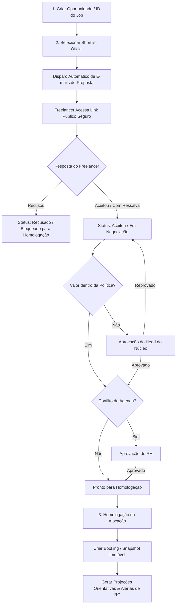

# **FREELA HUB — Documento Funcional da Plataforma**

**Versão:** v3.0  
**Projeto:** FREELA HUB | V3A  
**Responsável pelo documento:** [Renato Gioia]  
**Data da última atualização:** [29/07/2026]  
**Status:** Em evolução  

### **Histórico desta versão**

A versão v3.0 consolida as seguintes mudanças e atualizações estruturais:

* Inclusão do campo **ID do Job** como identificador operacional obrigatório e único da oportunidade em todo o seu ciclo de vida.
* Padronização rigorosa do **ID do Job** no formato `XX-XXXX-XXX` (`ano-cliente-sequencial`), com máscara automática, validação de duplicidade e regra de imutabilidade pós-criação.
* Inclusão da chave de negócio (`job_code`) em todos os módulos, cards, tabelas, filtros, buscas, relatórios, timelines, bookings, avaliações, notificações e auditorias.
* Inclusão do step de **disparo automático de e-mail para aceite ou recusa de proposta pelo freelancer** a partir da confirmação do Shortlist Oficial.
* Criação de **link público dedicado, individual e seguro** com token temporário e opaco (`purpose = proposal_response`) para visualização da proposta e coleta de resposta do freelancer.
* Estruturação da tela pública em modo somente leitura com botões de ação ("Aceitar Proposta", "Aceitar Proposta com Ressalvas de Valores", "Recusar Proposta"), motivo obrigatório de recusa e observações.
* Atualização do workflow de Shortlist & Negociação para bloquear homologação de freelancers que recusaram ou estão aguardando resposta (`waiting_response`), permitindo homologação apenas para candidatos com aceite registrado ou exceção autorizada.
* Integração de notificações por e-mail e alertas internos ao núcleo contratante e Head do Núcleo após a resposta do candidato.
* Atualização global do aviso obrigatório de pagamentos em todas as telas e seções do documento, **removendo definitivamente o trecho "Data sugerida, não oficial."**.
* Definição do novo disclaimer padrão de pagamentos: *"⚠️ Aviso Importante: O pagamento depende da abertura e aprovação da RC pelo núcleo contratante no ERP de Supply, respeitando os prazos e políticas internas."*
* Expansão da arquitetura Supabase com as tabelas `proposal_invitations`, `email_events`, atualização de `jobs` (campo `job_code`) e extensão de `public_links`.
* Definição de boas práticas de segurança para disparo de e-mail server-side, uso de variáveis de ambiente para SMTP e proibição absoluta de armazenamento de credenciais em código ou arquivos de especificação.

---

## **1. Visão Geral**

O **FREELA HUB** é a plataforma interna oficial de gestão de freelancers da V3A, desenvolvida para centralizar todo o ciclo de vida da contratação de talentos externos: cadastro, pré-cadastro, triagem, formação de shortlist, disparo de propostas, negociação, homologação, alocação (booking), acompanhamento operacional de agenda, projeções de pagamento e avaliações de desempenho.

A plataforma atua como uma camada central de governança entre Núcleos Contratantes, RH, C-Level, Operações, Heads de Núcleo e Freelancers. O sistema garante o cumprimento da Política de Valores, o controle de indisponibilidade/conflitos de agenda e a rastreabilidade total por meio de audit logs imutáveis e identificadores padronizados, com destaque para o **ID do Job** (`XX-XXXX-XXX`).

A plataforma **não substitui o ERP de Supply**, não realiza liquidação financeira, não emite requisições de compra oficiais (RC), não aprova RC e não confirma datas oficiais de pagamento. Seu papel é estruturar a demanda, formalizar os termos negociados com o freelancer, coletar o aceite digital via link público e apresentar previsões operacionais de desembolso baseadas nas políticas vigentes.

Toda projeção de pagamento apresentada pelo FREELA HUB deverá obrigatoriamente exibir o seguinte aviso:

> **⚠️ Aviso Importante: O pagamento depende da abertura e aprovação da RC pelo núcleo contratante no ERP de Supply, respeitando os prazos e políticas internas.**

---

## **2. Objetivos da Plataforma**

### **2.1 Objetivo principal**

Centralizar, padronizar e auditar o ciclo completo de contratação e gestão de freelancers na V3A, desde o surgimento da oportunidade até a avaliação final da entrega, garantindo aderência às políticas financeiras, governança operacional e rastreabilidade total via **ID do Job**.

### **2.2 Objetivos específicos**

* Registrar e rastrear o **ID do Job** (`XX-XXXX-XXX`) como a chave operacional e pública única da oportunidade em todas as etapas e módulos.
* Permitir o aceite ou recusa formal da proposta pelo freelancer através de link público individual e seguro antes da homologação final.
* Automação de disparo de e-mails de proposta para profissionais selecionados no Shortlist Oficial.
* Manter um banco único, limpo e homologado de freelancers, eliminando duplicidades por CNPJ, e-mail ou telefone.
* Controlar agenda, disponibilidade e conflitos de alocação de freelancers em múltiplos projetos simultâneos.
* Padronizar os tetos remuneratórios por função, senioridade e modelo de pagamento (diária, hora, mensal, job fechado).
* Estruturar o workflow de contratação em etapas claras: Seleção do Job → Shortlist Oficial → Disparo de Proposta → Negociação & Aceite → Aprovações de Exceção → Homologação → Alocação.
* Registrar negociações individuais, exceções de valor autorizadas e condições de **success fee** para projetos em concorrência comercial.
* Exigir aprovação do Head do Núcleo para qualquer negociação que supere a política de valores estabelecida.
* Exigir aprovação do RH para alocações com conflitos parciais de agenda.
* Gerar alocações oficiais (bookings) vinculadas ao snapshot imutável das condições homologadas.
* Calcular projeções orientativas de pagamento de acordo com as regras operacionais da Política de Supply (vencimentos às terças-feiras).
* Exibir a data-limite recomendada para abertura da RC (com antecedência mínima de 10 dias corridos em relação à projeção).
* Deixar explícito em toda a interface que as projeções dependem exclusivamente da abertura e aprovação da RC no ERP de Supply.
* Disponibilizar avaliações contínuas (checkpoints), avaliações de encerramento pelo núcleo e avaliações reversas pelo freelancer.
* Consolidar avaliações válidas no score de performance do freelancer para orientar futuras alocações.
* Garantir segurança server-side no disparo de e-mails, com uso estrito de variáveis de ambiente e hashes de token.
* Oferecer relatórios gerenciais e operacionais pesquisáveis por ID do Job, sem emitir ordens de pagamento financeiras.

---

## **3. Perfis de Acesso**

A plataforma dispõe de matriz de acessos estruturada por perfis de usuário, garantindo o princípio do menor privilégio e o isolamento por Row Level Security (RLS) no Supabase.

| Perfil | Descrição | Principais Permissões |
| :--- | :--- | :--- |
| **MASTER** | Perfil administrativo supremo | Acesso irrestrito a todos os módulos, gestão de usuários, criação de núcleos, parametrização de políticas, templates de e-mail, override de aprovações, auditoria técnica e configurações globais do sistema. |
| **RH** | Perfil de governança operacional de pessoas | Gestão do banco de freelancers, validação de pré-cadastros, geração de links públicos, administração da Política de Valores, acompanhamento de convites de proposta, liberação de exceções de agenda e mediação do score. |
| **C-LEVEL** | Perfil estratégico multi-núcleo | Acesso de leitura e operação em todos os núcleos, criação de oportunidades, acompanhamento de shortlists, negociações estratégicas, aprovação de exceções de alto valor e acompanhamento de indicadores globais. |
| **OPERAÇÃO** | Perfil operacional multi-núcleo | Atua transversalmente nos núcleos, cria oportunidades, acompanha bookings, monitora envio/resposta de propostas, verifica prazos operacionais de RC e apoia a gestão logística de alocações. |
| **NÚCLEO** | Perfil do núcleo contratante | Gestão restrita aos jobs e alocações do próprio núcleo: criação de oportunidade, formação de shortlist oficial, acompanhamento de respostas dos freelas, negociação, registro de entrega e avaliações. |
| **HEAD DO NÚCLEO** | Usuário do perfil Núcleo com autoridade de aprovação | Todas as permissões do perfil Núcleo, com poder adicional para aprovar/reprovar exceções de valor, condições de success fee e homologações do seu respectivo núcleo. |
| **FREELANCER** | Perfil externo sem login tradicional | Acesso temporário e restrito via links públicos seguros com token individual para: preenchimento de pré-cadastro, atualização cadastral, aceite/recusa de proposta de job e envio de avaliação reversa. |

### **3.1 Dependência externa — ERP de Supply**

O ERP de Supply é o único sistema oficial da V3A para abertura, fluxo de aprovação e liquidação financeira da Requisição de Compra (RC).

O FREELA HUB:
* **Não substitui** o ERP de Supply.
* **Não cria** e **não envia** RCs ao ERP de Supply (até que uma integração via API seja futuramente homologada).
* **Não aprova** RCs nem confirma recebimento financeiro.
* **Não determina** data oficial de pagamento nem confirma transferência bancária.
* **Não exibe** status como "pagamento solicitado", "RC aprovada" ou "pagamento realizado".
* Limita-se a apresentar projeções orientativas, prazos operacionais sugeridos para abertura da RC e alertas de antecedência.

---

## **4. Módulos da Plataforma**

### **4.1 Dashboard Geral**

O Dashboard Geral é o centro de controle da plataforma e adapta suas visualizações, cards e métricas conforme o perfil do usuário logado, respeitando as restrições por núcleo.

#### **Indicadores recomendados**

**Visão MASTER / C-Level / Operação (Visão Global)**
* **Jobs Ativos por ID do Job**: listagem rápida e contadores dos jobs em andamento.
* Total de freelancers cadastrados, elegíveis e bloqueados.
* Alocações ativas no mês corrente.
* Jobs por status (Criação, Shortlist, Proposta Enviada, Negociação, Homologado, Bookado, Em Execução, Concluído).
* Jobs em concorrência comercial e status de elegibilidade de **success fee**.
* Propostas enviadas aguardando resposta de freelancer (`waiting_response`).
* Exceções de valor aguardando aprovação de Head do Núcleo.
* Projeções de pagamento com prazo operacional de RC em risco (alertas Urgente e Crítico).
* Avaliações pendentes por núcleo após a conclusão dos jobs.
* Alertas de duplicidade na base de freelancers.

**Visão RH**
* Pré-cadastros pendentes de análise e aprovação.
* Atualizações cadastrais enviadas via link público aguardando validação.
* Freelancers sem documentação ou sem função/senioridade homologada.
* Exceções de política de valores e conflitos de agenda em mediação.
* Links públicos ativos, utilizados, expirados e revogados.
* Distribuição de scores e histórico de avaliações reversas dos núcleos.

**Visão Núcleo / Head do Núcleo (Visão Restrita ao Núcleo)**
* Meus Jobs (exibindo obrigatoriamente o **ID do Job**, título e cliente).
* Status dos convites de proposta enviados aos freelancers selecionados (`sent`, `waiting_response`, `accepted`, `refused`).
* Negociações ativas e pendências de aprovação do Head.
* Projeções operacionais de pagamento do núcleo com indicação de data sugerida.
* **Prazo-limite sugerido para abertura da RC** no ERP de Supply.
* Lembretes de avaliação pendente de alocações encerradas do núcleo.

*Nenhum card ou indicador de pagamento no Dashboard deve sugerir liquidação concluída. Todas as listagens financeiras devem exibir o aviso obrigatório de dependência da RC.*

---

### **4.2 Cadastro de Núcleos**

Módulo administrativo para criação e gestão das unidades operacionais/células da V3A.

#### **Campos principais**
* Nome do núcleo (ex.: *Live Marketing, Trade, Digital, Cenografia, N22*).
* Código identificador do núcleo (ex.: *N01, N02, N22*).
* Head do Núcleo responsável (vínculo com usuário do sistema).
* E-mail corporativo do Head e e-mail do grupo do núcleo.
* Status operacional (*Ativo / Inativo*).
* Histórico de jobs vinculados (pesquisáveis por **ID do Job**).
* Histórico de alocações e avaliações.

#### **Regras**
* Todo núcleo deve obrigatoriamente possuir um Head vinculado.
* Usuários com perfil Núcleo pertencem obrigatoriamente a um único núcleo.
* Usuários MASTER, C-Level, Operação e RH navegam entre múltiplos núcleos.
* A exclusão de um núcleo que possui histórico de jobs/alocações é estritamente **lógica** (`deleted_at`), preservando a integridade dos dados históricos.

---

### **4.3 Gestão de Usuários**

Módulo para gerenciamento de contas de acesso internas.

#### **Campos principais**
* Nome completo e e-mail corporativo (`@v3a.ag`).
* Perfil de acesso (*MASTER, RH, C-LEVEL, OPERAÇÃO, NÚCLEO*).
* Núcleo principal vinculado (obrigatório para perfil Núcleo).
* Indicador de autoridade de aprovação (*Is Nucleus Head*).
* Status (*Ativo, Bloqueado, Inativo*).
* Registro de primeiro acesso e último login.

#### **Regras**
* Não é permitido cadastrar usuário do perfil Núcleo sem vincular um núcleo válido.
* A alteração de perfis de acesso e concessão de privilégios de Head gera registro automático em `audit_logs`.
* O sistema deve oferecer redefinição segura de senha via token temporário.

---

### **4.4 Banco de Freelancers**

Módulo centralizador dos talentos externos da V3A.

#### **Fontes de entrada**
1. Cadastro direto realizado pelo RH.
2. Pré-cadastro externo via Link Público ou QR Code.
3. Atualização cadastral solicitada via Link Público individual.

#### **Campos principais**
* Nome completo e Nome Social.
* CNPJ (obrigatório para contratação PJ) e Razão Social.
* CPF (para identificação e validação fiscal).
* E-mail principal e Telefone/WhatsApp (com código de país).
* Cidade, Estado (UF) e País.
* Função Principal homologada e Senioridade (*Júnior, Pleno, Sênior, Especialista*).
* Funções Secundárias/Adicionais homologadas.
* Disponibilidade de deslocamento e trabalho remoto/presencial.
* Experiência prévia com a V3A, marcas e segmentos atendidos.
* Links de Portfólio, LinkedIn, Instagram Profissional e Site.
* Status Operacional (*Pendente, Elegível, Bloqueado, Inativo*).
* **Score Consolidado** (calculado automaticamente com base em avaliações).
* Histórico completo de alocações (com visualização do **ID do Job** em cada alocação).
* Histórico de convites de proposta, aceites e recusas.

#### **Regras de qualidade e deduplicação**
* O sistema deve bloquear duplicidades no pré-cadastro comparando CNPJ, CPF, E-mail e Nome Normalizado (sem acentos e em caixa baixa).
* Links de atualização cadastral **nunca** criam um novo registro; eles atualizam o cadastro existente após aprovação do RH.
* O histórico contratual e de avaliações deve ser integralmente preservado mesmo em caso de unificação/mesclagem de perfis pelo RH.

---

### **4.5 Links Públicos / QR Codes**

Módulo responsável pela geração, controle e rastreamento de links públicos com tokens temporários e seguros.

#### **Finalidades dos links**
1. `registration`: Novo pré-cadastro de freelancer.
2. `update`: Atualização cadastral de freelancer existente.
3. `proposal_response`: **Aceite ou recusa de proposta pelo freelancer** (vinculado a um job específico).
4. `reverse_evaluation`: Avaliação reversa do job e do núcleo feita pelo freelancer.

#### **Regras de segurança e governança**
* Cada link público possui um **token opaco** (hash SHA-256 no banco), sem expor UUIDs internos ou sequenciais previsíveis.
* Todos os links possuem data/hora de expiração configurável (`expires_at`).
* Para a finalidade `proposal_response`, o link é estritamente **individual e de uso único**: após o envio da resposta (aceite ou recusa), o link é marcado como `used` e é bloqueado contra novas submissões.
* O sistema registra IP, User-Agent, data/hora do acesso e data/hora da resposta.
* Links expirados, revogados ou já utilizados exibem tela informativa amigável e impedem novo preenchimento.

---

### **4.6 Análise de Pré-Cadastros**

Módulo de triagem onde o RH analisa formulários externos recebidos.

#### **Estrutura de análise**
* **Novos Pré-Cadastros**: análise de perfil, portfólio e documentação. A aprovação converte o registro em freelancer elegível no Banco de Freelancers.
* **Atualizações Cadastrais**: comparação lado a lado entre dados antigos e novos. A aprovação aplica as alterações no perfil do freelancer.
* **Rejeição**: exige preenchimento de justificativa interna e altera o status do formulário.

---

### **4.7 Criar Oportunidade**

Módulo onde é registrada uma nova demanda de freelancer para um projeto ou job da V3A.

#### **Quem pode criar**
* MASTER, RH, C-Level, Operação e Usuários do Núcleo responsável pela demanda.

#### **Campos principais do job**

1. **ID do Job (Campo Obrigatório - Identificador Operacional)**
   * **Nome da Label**: `ID do Job *`
   * **Formato obrigatório**: `XX-XXXX-XXX` (`ano-cliente-sequencial`).
   * **Composição**:
     * `XX`: Ano com 2 dígitos (ex.: `26` para 2026).
     * `XXXX`: Código numérico do cliente/projeto com 4 dígitos (ex.: `0042`).
     * `XXX`: Sequencial numérico do job com 3 dígitos (ex.: `001`).
     * *Exemplo completo*: `26-0042-001`.
   * **Regras do ID do Job**:
     * Deve conter exatamente 9 números e 2 hífenes no padrão `XX-XXXX-XXX`.
     * Apresentar máscara automática de digitação no frontend.
     * Realizar validação de duplicidade em tempo real antes de salvar.
     * Deve ser único na tabela de jobs (`job_code text not null unique`).
     * Em caso de duplicidade, exibir erro claro: *"Já existe uma oportunidade cadastrada com este ID do Job."*
     * É a **business key visível** do job em todas as telas, relatórios, notificações, e-mails, cards e links públicos.
     * Não substitui a chave primária técnica (`id uuid`) no banco Supabase.
     * Após a criação do job, o ID do Job torna-se **imutável**, podendo ser editado apenas por usuário MASTER mediante justificativa auditada.

2. **Dados da Demanda**
   * Núcleo Responsável (combo de seleção).
   * Título do Job / Oportunidade (ex.: *Diretor de Arte para Convenção Anual*).
   * Cliente / Projeto (ex.: *Nestlé - Campanha Páscoa*).
   * Função Requerida e Senioridade Requerida (*Júnior, Pleno, Sênior, Especialista*).
   * Regime de Urgência (*Baixa, Média, Alta, Crítica*).
   * Período Estimado: Data de Início e Data de Fim.
   * Total de dias (calculado de forma inclusiva: `Fim - Início + 1`).
   * Budget Previsto Máximo (R$).
   * Descrição Técnica / Escopo da Atividade (com opção de apoio de IA).
   * Entregáveis / Milestones esperados.

3. **Modelo de Remuneração e Success Fee**
   * Modelo de Remuneração (*Diária, Hora, Mensal, Job Fechado*).
   * Valor Previsto (R$).
   * Indicador de Job em Concorrência Commercial (*Sim / Não*).
   * Indicador de **Success Fee Aplicável** (*Sim / Não*).
   * Se Success Fee = Sim:
     * Tipo (*Valor Fixo R$* ou *Percentual %*).
     * Valor fixo ou percentual proposto.
     * Base de cálculo do percentual (ex.: *Valor-base negociado*).
     * Gatilho de elegibilidade: *Vitória da V3A na concorrência comercial*.
     * Condições complementares.

#### **Regras de pagamento na criação**
* O criador do job **não define parcelas, não escolhe datas de vencimento nem altera calendários**.
* O FREELA HUB exibirá apenas uma simulação preliminar orientativa baseada na Política de Supply.

---

## **5. Modelos de Remuneração e Projeção Orientativa de Pagamento**

### **5.1 Modelos de remuneração**

A plataforma suporta quatro modelos comerciais de contratação:

* **Diária**: `Valor Base Total = Valor da Diária × Quantidade de Diárias`
* **Hora**: `Valor Base Total = Valor da Hora × Total de Horas Estimadas`
* **Mensal**: `Valor Base Total = Valor Mensal × Quantidade de Meses/Proporcional`
* **Job Fechado / Pacote**: `Valor Base Total = Valor Fixo Negociado para o Escopo`

### **5.2 Política de projeção de pagamento (Diretrizes de Supply)**

As datas de pagamento apresentadas no FREELA HUB são **projeções operacionais orientativas** calculadas automaticamente pelo sistema após a homologação da alocação.

#### **Regra de cálculo da duração**
A duração total da alocação é calculada inclusivamente:
$$\text{Duração (dias)} = \text{Data Fim} - \text{Data Início} + 1$$

Para evitar brechas de regra, períodos de exatamente 15 dias são enquadrados na primeira faixa (1 a 15 dias).

#### **Faixas de projeção (Vencimentos obrigatoriamente às terças-feiras)**

| Duração da Alocação | Regra da Projeção de Pagamento |
| :--- | :--- |
| **1 a 15 dias** | Projeção para até 15 dias corridos após a data final do job, ajustada para a **última terça-feira** dentro desse intervalo. |
| **16 a 21 dias** | Projeção para até 7 dias corridos após a data final do job, ajustada para a **terça-feira** compreendida no intervalo. |
| **22 a 30 dias** | Projeção para a **última terça-feira** compreendida *dentro* do próprio período da alocação. |
| **Acima de 30 dias** | Alocação dividida em ciclos mensais; projeção na **última terça-feira** de cada ciclo mensal. |

#### **Aviso obrigatório de pagamentos (Global)**

Em **todas** as visualizações de projeção de pagamento, cards financeiros, telas de alocação, homologação e relatórios, deve constar o disclaimer atualizado:

> **⚠️ Aviso Importante: O pagamento depende da abertura e aprovação da RC pelo núcleo contratante no ERP de Supply, respeitando os prazos e políticas internas.**

*Fica expressamente proibida a utilização do trecho antigo "Data sugerida, não oficial." em qualquer local da plataforma.*

### **5.3 Prazo operacional da RC (Requisição de Compra)**

Para cada parcela ou ciclo projetado, o FREELA HUB calcula o prazo operacional limite para que o núcleo abra a RC no ERP de Supply:

$$\text{Prazo Limite da RC} = \text{Data Sugerida de Pagamento} - 10 \text{ dias corridos}$$

#### **Níveis de alerta de antecedência da RC**

| Janela até o Prazo Limite da RC | Nível do Alerta | Ação do Sistema |
| :--- | :--- | :--- |
| Mais de 10 dias corridos | **Informativo** | Exibição de badge azul no card da alocação. |
| Entre 4 e 10 dias corridos | **Atenção** | Badge amarelo; notificação no Dashboard do Núcleo. |
| Entre 0 e 3 dias corridos | **Urgente** | Badge laranja; notificação por e-mail ao solicitante. |
| Prazo ultrapassado (atraso na abertura) | **Crítico** | Badge vermelho piscante; e-mail escalado ao Head do Núcleo. |

---

## **6. Política de Valores**

A Política de Valores estabelece os parâmetros remuneratórios de referência e teto autorizados pela diretoria da V3A.

### **6.1 Estrutura de referência**
Cada combinação de **Função + Senioridade** possui valores cadastrados para diária, hora e valor mensal.

### **6.2 Status da política na negociação**
* **Dentro da Política**: valor negociado $\le$ teto da política.
* **Acima do Teto (Exceção)**: valor negociado $>$ teto da política. Exige aprovação formal do Head do Núcleo no FREELA HUB.
* **Política Não Cadastrada**: exige justificativa do solicitante e validação do RH.

---

## **7. Workflow de Shortlist, Negociação, Disparo de Proposta e Alocação**

O workflow central do FREELA HUB é estruturado em etapas sequenciais com governança de aprovação e aceite formal do freelancer.



---

### **7.1 Etapa 1 — Criar Oportunidade e Gerar ID do Job**
* O usuário cadastra a demanda preenchendo obrigatoriamente o **ID do Job** (`XX-XXXX-XXX`), escopo, datas estimadas, modelo de remuneração e budget.
* O job assume o status inicial `created`.

---

### **7.2 Etapa 2 — Shortlist Oficial e Disparo Automático de Propostas**

#### **Formação do Shortlist**
* O sistema sugere freelancers compatíveis divididos em: *Melhores Matches, Boas Alternativas e Outras Opções*, analisando função, senioridade, score, histórico V3A e disponibilidade de agenda.
* O usuário do núcleo seleciona os profissionais desejados e clica em **"Confirmar Shortlist Oficial"**.

#### **Disparo Automático de E-mails (Novo Step v3.0)**
Ao confirmar o Shortlist Oficial:
1. O job muda o status para `in_shortlist`.
2. Para cada candidato selecionado, o sistema cria um registro em `proposal_invitations` com status `waiting_response`.
3. O sistema gera automaticamente um link público individual (`purpose = proposal_response`) contendo um token único opaco.
4. O servidor dispara automaticamente um e-mail individual para o e-mail do freelancer cadastrado no banco.
5. É registrado um evento auditável em `email_events` e no histórico do job.

---

### **7.3 Etapa 3 — Resposta do Freelancer via Página Pública Segura**

#### **Acesso e Visualização**
O freelancer clica no link recebido por e-mail e é direcionado para a página pública da plataforma (sem necessidade de login).

A página exibe, em **modo somente leitura**:
* **ID do Job** (`XX-XXXX-XXX`) e Título da Oportunidade.
* Cliente e Núcleo Contratante da V3A.
* Função e Senioridade solicitadas.
* Período Estimado da atuação (Data Início a Data Fim).
* Descrição Técnica e Escopo das atividades.
* Entregáveis e Milestones esperados.
* Modelo de Remuneração e Valor-Base proposto (R$).
* Indicador de Success Fee, valor/percentual e condições (se houver).
* Observações gerais do núcleo.
* **Aviso Obrigatório de Supply sobre regras de pagamento da RC**.

#### **Botões de Ação na Página Pública**

1. **[ Aceitar Proposta ]**
   * Registra o aceite integral dos valores e datas propostos.
   * Muda status para `accepted`.

2. **[ Aceitar Proposta com Ressalvas de Valores ]**
   * Abre campo de texto obrigatório para o freelancer descrever sua contraproposta de valor ou condição.
   * Muda status para `accepted_with_reservations` / `in_negotiation`.

3. **[ Recusar Proposta ]**
   * Abre modal obrigatório solicitando:
     * Motivo principal da recusa (combo: *Indisponibilidade de agenda, Valor abaixo da expectativa, Conflito de escopo, Motivos pessoais, Outros*).
     * Observações adicionais (opcional).
   * Muda status para `refused`.

#### **Regras da Página Pública**
* O freelancer só pode submeter a resposta **uma única vez**.
* Após o envio, o link é marcado como `used` e exibe mensagem de confirmação, bloqueando alterações posteriores.
* O sistema salva `responded_at`, `response_type`, `refusal_reason`, IP e User-Agent.
* A resposta dispara notificação automática por e-mail ao solicitante do núcleo e ao Head do Núcleo.

---

### **7.4 Etapa 4 — Negociação & Aprovações de Exceção**

* Candidates que **recusaram** a proposta são marcados no card com badge vermelho *"Proposta Recusada"* e ficam **definitivamente bloqueados para homologação** naquele job.
* Candidatos que **aceitaram** ou aceitaram com ressalva avançam na negociação.
* Se o valor negociado for superior à Política de Valores: o sistema gera uma pendência em `approval_requests` enviando notificação ao **Head do Núcleo**.
* Se houver conflito parcial de agenda: o sistema exige aprovação do **RH**.
* Apenas candidatos com status `accepted` (ou `accepted_with_reservations` ajustado) e com todas as aprovações pendentes concedidas mudam para `ready_for_homologation`.

---

### **7.5 Etapa 5 — Homologação da Alocação**

A homologação é o ato formal de confirmação da contratação do freelancer escolhido pelo núcleo.

#### **Ações ao clicar em "Confirmar Homologação"**
1. O job muda seu status para `booked`.
2. O candidato selecionado tem sua negociação alterada para `homologated`.
3. É criada a **Alocação Oficial** (`allocations`), gerando um **snapshot imutável** (`snapshot_payload`) de todos os dados negociados, incluindo obrigatoriamente o **ID do Job**.
4. O sistema gera automaticamente as **Projeções Orientativas de Pagamento** e o **Prazo-Limite da RC**.
5. O freelancer é bloqueado na agenda para o período homologado.
6. Todos os demais candidatos do shortlist que não foram escolhidos são finalizados como `not_selected`.
7. O FREELA HUB **não emite** ordem de pagamento nem gera arquivo financeiro para o ERP de Supply.

---

## **8. Booking / Alocação**

A Alocação (Booking) representa o contrato operacional vigente entre a V3A e o freelancer.

### **8.1 Campos do Registro de Alocação**
* Código da Alocação (ex.: `ALOC-2026-0891`).
* **ID do Job** (`job_code`: `XX-XXXX-XXX`) — preservado no snapshot.
* Freelancer vinculado (`freelancer_id`).
* Núcleo e Cliente.
* Função e Senioridade contratadas.
* Período definitivo (Data Início e Data Fim inclusivas).
* Modelo de remuneração e Valor-Base garantido.
* Regra e status do **Success Fee** (se houver).
* Projeções operacionais de pagamento e Prazos sugeridos de RC.
* Status da Alocação (*Bookada, Ativa, Em Execução, Entregue, Concluída, Cancelada*).

---

## **9. Timeline de Alocações**

Módulo visual de visão de calendário (Gantt/Timeline) para gestão de ocupação de talentos.

### **9.1 Funcionalidades e Exibição do ID do Job**
* Visualização por dia, semana e mês.
* Identificação clara de sobreposições e conflitos de agenda.
* **No hover (passar o mouse) sobre o card da alocação**: tooltip detalhado exibindo obrigatoriamente:
  * **ID do Job** (`XX-XXXX-XXX`) e Título do Job.
  * Cliente e Núcleo.
  * Freelancer alocado e Função.
  * Período da alocação.
  * Projeção da próxima data de pagamento e Prazo sugerido da RC.
  * Disclaimer de Supply.
* **Ao clicar no card**: direciona diretamente para os detalhes da alocação.

---

## **10. Projeções de Pagamento e Alertas de RC**

Este módulo exibe a gestão temporal das previsões operacionais de desembolso do núcleo.

### **10.1 Regras de exibição**
* Exibe a lista de alocações com suas respectivas datas projetadas (sempre às terças-feiras).
* Exibe o **Prazo Limite para Abertura da RC** (D-10 corridos).
* Exibe a tag com o nível de alerta (*Informativo, Atenção, Urgente, Crítico*).
* Botão para o usuário do núcleo clicar e **"Confirmar Ciência do Alerta da RC"** (apenas registro operacional de ciência, sem alterar status financeiro).
* **Todas as telas deste módulo devem conter o aviso obrigatório de pagamentos.**

---

## **11. Avaliações e Score do Freelancer**

A avaliação no FREELA HUB é independente do fluxo financeiro e é composta por 3 modalidades:

### **11.1 Checkpoints (Durante a alocação)**
* Avaliações intermediárias opcionais durante a execução do job para registrar performance parcial.

### **11.2 Avaliação Final (Pelo Núcleo)**
* Avaliação obrigatória preenchida pelo núcleo após a conclusão do job.
* Avalia critérios como: *Qualidade Técnica, Aderência ao Briefing, Cumprimento de Prazos, Comunicação e Autonomia*.
* Alimenta o **Score Consolidado** do freelancer.
* Se a avaliação não for preenchida em até $X$ dias (padrão: 3 dias) após o encerramento do job, o sistema gera pendência e alerta por e-mail ao núcleo.

### **11.3 Avaliação Reversa (Pelo Freelancer)**
* Formulário público enviado via link seguro para o freelancer avaliar o briefing, a liderança e a organização do núcleo da V3A.

---

## **12. Segurança, E-mail e SMTP**

### **12.1 Segurança das credenciais e infraestrutura**
* **É proibido** hardcodar senhas, credenciais SMTP ou tokens em arquivos Markdown, código-fonte frontend ou repositórios Git.
* Todo o envio de e-mail deve ser executado exclusivamente **server-side** (via Supabase Edge Functions ou API Node.js isolada).
* As credenciais do servidor SMTP devem ser armazenadas em **variáveis de ambiente protegidas** e secrets do ambiente de deploy.

### **12.2 Variáveis de Ambiente Recomendadas**
```bash
FREELAHUB_EMAIL_FROM="Freela Hub V3A <freelahub@v3a.ag>"
FREELAHUB_SMTP_USER="freelahub@v3a.ag"
FREELAHUB_SMTP_PASS="[DEFINIDO_EM_SECRET_DE_DEPLOY]"
FREELAHUB_SMTP_HOST="smtp.provedor.com"
FREELAHUB_SMTP_PORT="587"
FREELAHUB_SMTP_SECURE="true"
FREELAHUB_PUBLIC_APP_URL="https://freelahub.v3a.ag"
```

### **12.3 Template de E-mail de Proposta (Modelo Funcional)**

**Assunto**: `Proposta de oportunidade — [ID do Job] [Título do Job]`

**Corpo do E-mail**:
```text
Olá, [Nome do Freelancer].

Você foi selecionado para avaliar uma oportunidade de atuação junto à V3A no FREELA HUB.

DADOS DA OPORTUNIDADE:
• ID do Job: [ID do Job]
• Job: [Título do Job]
• Cliente / Projeto: [Nome do Cliente]
• Núcleo Contratante: [Nome do Núcleo]
• Função: [Função Requerida] ([Senioridade])
• Período Estimado: [Data Início] a [Data Fim]
• Modelo de Remuneração: [Modelo]
• Valor-Base Proposto: R$ [Valor Previsto]

Para visualizar os detalhes completos do escopo, entregáveis e responder se ACEITA ou RECUSA a proposta, acesse o link seguro abaixo:

👉 [ Botão / Link: Visualizar e Responder Proposta ]
([URL_PUBLICA_COM_TOKEN])

Atenção: Este link é individual, temporário e permite apenas uma resposta.

Atenciosamente,
Equipe FREELA HUB | V3A
```

*Regras de Redação (Copywriting)*: O e-mail não deve prometer contratação garantida antes da homologação, não deve informar que a RC foi aprovada e deve utilizar remetente no-reply/institucional.

---

## **13. Governança e Compliance**

* Toda oportunidade criada gera obrigatoriamente um **ID do Job** no padrão `XX-XXXX-XXX`.
* Nenhum freelancer pode ser homologado sem registro prévio de aceite da proposta ou autorização explícita de exceção.
* Alterações no ID do Job após a criação dependem de permissão MASTER e justificativa auditada.
* Projeções de pagamento devem manter a rastreabilidade da versão da regra de Supply aplicada.
* Exclusões de registros com histórico operacional são exclusivamente **lógicas**.

---

## **14. Regras de Permissão por Perfil**

| Ação / Módulo | MASTER | RH | C-LEVEL | OPERAÇÃO | NÚCLEO | HEAD NÚCLEO | FREELANCER |
| :--- | :---: | :---: | :---: | :---: | :---: | :---: | :---: |
| **Criar Job / Definir ID do Job** | Sim | Sim | Sim | Sim | Sim | Sim | Não |
| **Editar ID do Job pós-criação** | Sim (Audit) | Não | Não | Não | Não | Não | Não |
| **Confirmar Shortlist & Disparar E-mails** | Sim | Sim | Sim | Sim | Sim | Sim | Não |
| **Aceitar / Recusar Proposta** | Não | Não | Não | Não | Não | Não | Sim (Via Link) |
| **Aprovar Exceção de Valor** | Sim | Não | Sim | Não | Não | Sim (Próprio) | Não |
| **Aprovar Conflito de Agenda** | Sim | Sim | Não | Não | Não | Não | Não |
| **Homologar Alocação** | Sim | Sim | Sim | Não | Não | Sim (Próprio) | Não |
| **Confirmar Ciência da RC** | Sim | Sim | Sim | Sim | Sim | Sim | Não |
| **Preencher Avaliação Final** | Sim | Sim | Sim | Sim | Sim | Sim | Não |
| **Preencher Avaliação Reversa** | Não | Não | Não | Não | Não | Não | Sim (Via Link) |
| **Configurar Templates/SMTP** | Sim | Não | Não | Não | Não | Não | Não |

---

## **15. Estados e Status Recomendados**

### **15.1 Status do Job (`jobs.status`)**
`created`, `in_shortlist`, `in_negotiation`, `pending_approval`, `ready_for_homologation`, `booked`, `in_execution`, `waiting_competition_result`, `completed`, `cancelled`, `reopened`.

### **15.2 Status dos Convites de Proposta (`proposal_invitations.status`)**
`created`, `sent`, `delivered`, `opened`, `waiting_response`, `accepted`, `accepted_with_reservations`, `refused`, `expired`, `cancelled`.

### **15.3 Status da Negociação (`negotiations.status`)**
`selected`, `in_negotiation`, `waiting_response`, `pending_head_approval`, `approved_by_head`, `rejected_by_head`, `accepted`, `refused`, `ready_for_homologation`, `homologated`.

### **15.4 Status da Alocação (`allocations.status`)**
`booked`, `active`, `in_execution`, `pending_delivery`, `delivered`, `pending_evaluation`, `completed`, `cancelled`, `reopened`.

---

## **16. Estrutura de Dados Recomendada — Supabase**

### **16.1 Alterações e Novas Tabelas**

#### **Tabela `jobs` (Atualização)**
Adição do campo de identificação operacional obrigatório:
```sql
ALTER TABLE jobs ADD COLUMN job_code TEXT NOT NULL UNIQUE;
ALTER TABLE jobs ADD CONSTRAINT check_job_code_format CHECK (job_code ~ '^\d{2}-\d{4}-\d{3}$');
CREATE UNIQUE INDEX idx_jobs_job_code ON jobs(job_code);
```

#### **Tabela `proposal_invitations` (Nova Tabela)**
Armazena o ciclo de vida do convite/proposta enviado ao freelancer:
```sql
CREATE TABLE proposal_invitations (
    id UUID PRIMARY KEY DEFAULT gen_random_uuid(),
    job_id UUID NOT NULL REFERENCES jobs(id) ON DELETE RESTRICT,
    job_code TEXT NOT NULL,
    freelancer_id UUID NOT NULL REFERENCES freelancers(id) ON DELETE RESTRICT,
    shortlist_candidate_id UUID REFERENCES shortlist_candidates(id),
    negotiation_id UUID REFERENCES negotiations(id),
    public_link_id UUID REFERENCES public_links(id),
    status TEXT NOT NULL DEFAULT 'created', -- sent, waiting_response, accepted, refused, expired, cancelled
    sent_at TIMESTAMPTZ,
    opened_at TIMESTAMPTZ,
    responded_at TIMESTAMPTZ,
    response_type TEXT, -- accepted, accepted_with_reservations, refused
    refusal_reason TEXT,
    freelancer_notes TEXT,
    created_at TIMESTAMPTZ DEFAULT NOW(),
    created_by UUID REFERENCES users(id),
    updated_at TIMESTAMPTZ DEFAULT NOW(),
    updated_by UUID REFERENCES users(id)
);

CREATE INDEX idx_proposal_invitations_job ON proposal_invitations(job_id);
CREATE INDEX idx_proposal_invitations_freelancer ON proposal_invitations(freelancer_id);
```

#### **Tabela `email_events` (Nova Tabela)**
Rastreamento de envios de e-mail e integração SMTP:
```sql
CREATE TABLE email_events (
    id UUID PRIMARY KEY DEFAULT gen_random_uuid(),
    event_type TEXT NOT NULL, -- proposal_dispatch, reminder, evaluation_alert
    recipient_email TEXT NOT NULL,
    recipient_name TEXT,
    template_key TEXT NOT NULL,
    related_job_id UUID REFERENCES jobs(id),
    related_job_code TEXT,
    related_freelancer_id UUID REFERENCES freelancers(id),
    related_public_link_id UUID REFERENCES public_links(id),
    status TEXT NOT NULL, -- pending, sent, failed, error
    provider_message_id TEXT,
    error_message TEXT,
    sent_at TIMESTAMPTZ,
    created_at TIMESTAMPTZ DEFAULT NOW(),
    created_by UUID REFERENCES users(id),
    metadata JSONB
);

CREATE INDEX idx_email_events_status ON email_events(status);
```

#### **Tabela `public_links` (Atualização)**
Suporte à finalidade `proposal_response`:
```sql
ALTER TABLE public_links ADD COLUMN job_id UUID REFERENCES jobs(id);
ALTER TABLE public_links ADD COLUMN job_code TEXT;
ALTER TABLE public_links ADD COLUMN shortlist_candidate_id UUID REFERENCES shortlist_candidates(id);
ALTER TABLE public_links ADD COLUMN negotiation_id UUID REFERENCES negotiations(id);
ALTER TABLE public_links ADD COLUMN metadata JSONB;
```

---

## **17. Requisitos de UX/UI**

### **17.1 Exibição do ID do Job**
* O **ID do Job** (`XX-XXXX-XXX`) deve ser exibido com destaque em:
  * Cabeçalho dos detalhes do job e cards de listagem.
  * Título das modais de negociação e homologação.
  * Tabelas de booking, projeção de pagamento e relatórios.
  * Tooltips da Timeline de Alocações.
  * E-mails automáticos e telas públicas de proposta.

### **17.2 Componentes de Alerta de Pagamento**
* Todos os cards de projeção de pagamento devem conter uma banner/alert visual destacando o aviso obrigatório de Supply.

---

## **18. Relatórios e Exportações**

* Todos os relatórios gerenciais (PDF, XLSX, CSV) devem permitir filtro e busca por **ID do Job**.
* Fica vedada a exportação de qualquer documento com layout ou título de "Ordem de Pagamento", "Solicitação Financeira" ou "Requisição de Pagamento".

---

## **19. Fluxo Resumido da Plataforma**

```mermaid
flowchart LR
    A[Criar Oportunidade\nID do Job: XX-XXXX-XXX] --> B[Shortlist Oficial]
    B --> C[Disparo Automático\nE-mail com Link Público]
    C --> D[Página Pública\nAceite / Recusa do Freela]
    D --> E[Negociação & Aprovação Head]
    E --> F[Homologação & Booking]
    F --> G[Projeção de Pagamento\n(Terças-feiras + Aviso Supply)]
    G --> H[Execução & Avaliação]
```

---

## **20. Critérios de Aceite Gerais (v3.0)**

A atualização da plataforma para a v3.0 será considerada homologada quando:

1. O campo **ID do Job** for obrigatório na criação do job, validar o formato `XX-XXXX-XXX`, garantir unicidade e figurar em todas as telas, cards, relatórios e buscas.
2. A confirmação do Shortlist Oficial disparar automaticamente e-mails individuais aos freelancers com links seguros de token único.
3. A página pública permitir a visualização da proposta e coletar aceite, aceite com ressalvas ou recusa com motivo.
4. O status de recusa bloquear a homologação do freelancer para aquele job.
5. O aviso obrigatório sobre a dependência da RC no ERP de Supply estiver atualizado em 100% das telas do sistema, **sem qualquer ocorrência do trecho antigo "Data sugerida, não oficial."**.
6. As credenciais SMTP estiverem protegidas server-side via variáveis de ambiente.
7. A arquitetura de dados Supabase contiver as tabelas `proposal_invitations`, `email_events`, o campo `job_code` e os índices necessários.

---

## **21. Pendências e Melhorias Futuras**
* Integração nativa via API com ERP de Supply para leitura em tempo real do status da RC.
* Dashboard avançado de conversão de propostas enviadas vs. aceitas por núcleo.

---

## **22. Glossário**

| Termo | Definição |
| :--- | :--- |
| **ID do Job** | Código numérico estruturado (`XX-XXXX-XXX`) que serve como chave de negócio visível do job. |
| **Proposal Invitation** | Registro que controla o envio, abertura e resposta da proposta feita ao freelancer. |
| **Token Opaco** | Hash de segurança que identifica um link público sem expor a chave primária técnica do banco. |
| **Prazo Limite da RC** | Data estimada (D-10 corridos em relação à projeção) para o núcleo abrir a RC no ERP de Supply. |
| **ERP de Supply** | Sistema externo oficial de gestão financeira e de compras da V3A. |

---

## **23. Decisões Estratégicas para Validação**

1. Confirmar o tempo padrão de expiração do link público de proposta (recomendado: 48 horas corridas).
2. Definir o e-mail de cópia (BCC) institucional para acompanhamento dos convites disparados.
3. Homologar os textos finais dos e-mails de notificação junto à equipe de Comunicação e RH.
